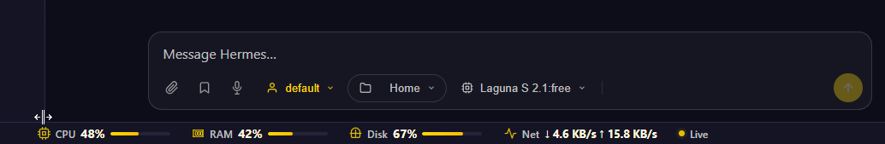

## Summary
Inspired by MobaXterm's always-visible live terminal resource monitor, this builds on the existing Insights system-health panel (#693) so resource usage is visible during normal use instead of hidden behind a side-panel.

- **Network Rx/Tx throughput** added to `GET /api/system/health` (previously CPU/RAM/Disk only). Read from `/proc/net/dev` → aggregate bytes over physical interfaces, loopback excluded, with a tiny stateless cross-request delta window for a bytes/sec rate. No per-interface or peer detail leaves the server.
- **Persistent bottom status bar** (`CPU / RAM / Disk / Net`) rendered into the app shell, mounted on load, polled every 5s whether or not the Insights panel is open — mirroring MobaXterm's persistent footer.
- **Settings → Appearance toggle** ("Show resource status bar") to turn the bar on/off (default on), backed by a `localStorage` key.

### Live screenshot

## Privacy
Inherits #693 invariants: coarse aggregates only. No process lists, command strings, user identities, env vars, or filesystem topology are exposed.

## Test plan
- 6 new regression tests in `tests/test_issue693_system_health_panel.py`: network delta math + loopback exclusion, payload inclusion + typing, route payload, markup/layout in app shell, and always-on polling gating.
- Updated the partial/unavailable contract test now that `network` is a collector (so "unavailable" requires all four to fail).
- Verified locally: backend unit + real HTTP (`/api/system/health` returns `network`), and the status-bar template renders the exact DOM the updater queries.

## Future resource modules (ideas for follow-up PRs)
The bar is designed so new metrics are just additional `data-rsb-metric` items fed from the same payload. Candidates worth exploring:
- **Uptime / hostname** — cheap from `/proc/uptime` and `socket.gethostname()`.
- **Per-mount disk usage** — root `/` plus notable mounts like `/tmp`, `/boot`, `/home` (coarse totals only, no topology leakage beyond named mounts).
- **Download / upload totals** — cumulative `rx_total_bytes` / `tx_total_bytes` alongside the live per-sec rate.
- **Boot info** — last boot time derived from `/proc/stat` btime or `uptime` math.

## Files
- `api/system_health.py` — `_read_proc_net_dev` / `_network_throughput` + `network` in payload
- `static/panels.js` — `_renderResourceStatusBar()` template + inline SVG icons
- `static/ui.js` — mount, update, always-on poll gating, settings toggle
- `static/style.css` — `.resource-status-bar` styles (slim, MobaXterm-like)
- `static/index.html` — settings toggle checkbox
- `docs/ui-ux/resource-status-bar-6729.png` — live screenshot

Co-Authored-By: Derp <derp@hermes.agent>
