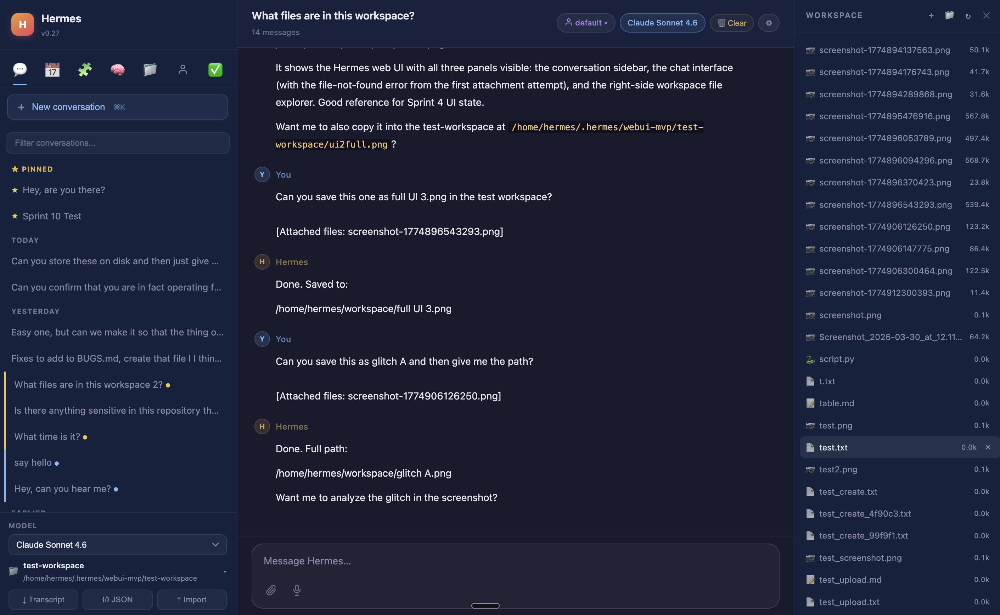
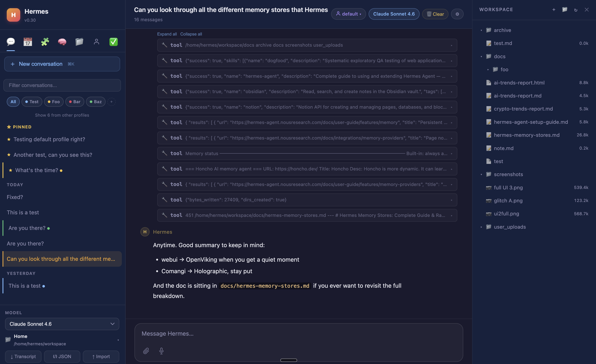

# Hermes Web UI

[Hermes Agent](https://hermes-agent.nousresearch.com/), sunucunuzda çalışan, terminal veya mesajlaşma uygulamaları üzerinden erişilen, öğrendiklerini hatırlayan ve çalıştıkça daha yetenekli hale gelen gelişmiş bir otonom ajandır.

Hermes WebUI, [Hermes Agent](https://hermes-agent.nousresearch.com/) için tarayıcınızda çalışan hafif, koyu temalı bir web arayüzüdür.
CLI deneyimiyle birebir uyumludur — terminalden yapabileceğiniz her şeyi
bu arayüzden de yapabilirsiniz. Build adımı, framework, bundler yok. Sadece Python
ve vanilla JS.

Düzen: üç panelli. Sol kenar çubuğu oturumlar ve gezinme için, orta panel sohbet için,
sağ panel çalışma alanı dosya gezgini için. Model, profil ve çalışma alanı kontrolleri
**oluşturucu alt bilgisinde** — yazarken her zaman görünür. Dairesel bağlam halkası
token kullanımını tek bakışta gösterir. Tüm ayarlar ve oturum araçları
**Hermes Kontrol Merkezi**'nde (kenar çubuğunun altındaki başlatıcı) bulunur.


<table>
  <tr>
    <td width="50%" align="center">
      
      <br /><sub>Tam profil desteğiyle açık mod</sub>
    </td>
    <td width="50%" align="center">
      
      <br /><sub>Ayarlarınızı özelleştirin, parola yapılandırın</sub>
    </td>
  </tr>
</table>

<table>
  <tr>
    <td width="50%" align="center">
      
      <br /><sub>Satır içi önizlemeli çalışma alanı dosya gezgini</sub>
    </td>
    <td width="50%" align="center">
      
      <br /><sub>Oturum projeleri, etiketler ve araç çağrı kartları</sub>
    </td>
  </tr>
</table>

Bu, size Hermes CLI ile **neredeyse 1:1 uyumlu, kullanışlı bir web arayüzü** sunar ve SSH tüneli üzerinden güvenle erişebilirsiniz. Başlatmak için tek komut, bilgisayarınızdan erişmek için tek SSH tünel komutu. Web arayüzünün her parçası, mevcut Hermes ajanınızı ve mevcut modellerinizi kullanır, ek yapılandırma gerektirmez.

---

## Neden Hermes

Çoğu AI aracı her oturumda sıfırlanır. Kim olduğunuzu, ne üzerinde çalıştığınızı veya
projenizin hangi kuralları takip ettiğini bilmezler. Her seferinde kendinizi yeniden açıklarsınız.

Hermes oturumlar arası bağlamı korur, siz çevrimdışıyken zamanlanmış işleri çalıştırır ve
çalıştıkça ortamınız hakkında daha akıllı hale gelir. Mevcut Hermes ajan kurulumunuzu,
mevcut modellerinizi kullanır ve başlamak için ek yapılandırma gerektirmez.

Onu diğer ajansal araçlardan ayıran özellikler:

- **Kalıcı bellek** — kullanıcı profili, ajan notları ve yeniden kullanılabilir prosedürleri
  kaydeden bir beceri sistemi; Hermes ortamınızı öğrenir ve yeniden öğrenmek zorunda kalmaz
- **Self-hosted zamanlama** — siz çevrimdışıyken ateşlenen ve sonuçları Telegram, Discord,
  Slack, Signal, e-posta ve daha fazlasına ileten cron işleri
- **10+ mesajlaşma platformu** — terminaldeki aynı ajana telefonunuzdan erişilebilir
- **Kendini geliştiren beceriler** — Hermes deneyimlerinden otomatik olarak beceriler yazıp
  kaydeder; göz atılacak pazar yeri yok, kurulacak eklenti yok
- **Sağlayıcıdan bağımsız** — OpenAI, Anthropic, Google, DeepSeek, OpenRouter ve daha fazlası
- **Diğer ajanları yönetme** — ağır kodlama görevleri için Claude Code veya Codex başlatıp
  sonuçları kendi belleğine getirebilir
- **Self-hosted** — konuşmalarınız, belleğiniz, donanımınız

**vs. diğerleri** *(manzara aktif olarak değişiyor — tam karşılaştırma için [HERMES.md](HERMES.md)'e bakın)*:

| | OpenClaw | Claude Code | Codex CLI | OpenCode | Hermes |
|---|---|---|---|---|---|
| Kalıcı bellek (otomatik) | Evet | Kısmi† | Kısmi | Kısmi | Evet |
| Zamanlanmış işler (self-hosted) | Evet | Hayır‡ | Hayır | Hayır | Evet |
| Mesajlaşma uygulaması erişimi | Evet (15+ platform) | Kısmi (Telegram/Discord önizleme) | Hayır | Hayır | Evet (10+) |
| Web UI (self-hosted) | Yalnızca dashboard | Hayır | Hayır | Evet | Evet |
| Kendini geliştiren beceriler | Kısmi | Hayır | Hayır | Hayır | Evet |
| Python / ML ekosistemi | Hayır (Node.js) | Hayır | Hayır | Hayır | Evet |
| Sağlayıcıdan bağımsız | Evet | Hayır (yalnızca Claude) | Evet | Evet | Evet |
| Açık kaynak | Evet (MIT) | Hayır | Evet | Evet | Evet |

† Claude Code'un CLAUDE.md / MEMORY.md proje bağlamı ve dönen otomatik belleği var, ancak tam otomatik oturumlar arası hatırlama yok  
‡ Claude Code'un bulut yönetimli zamanlaması (Anthropic altyapısı) ve oturum kapsamlı `/loop`'u var; self-hosted cron yok

**En yakın rakip OpenClaw'dır** — ikisi de her zaman açık, self-hosted, açık kaynaklı,
bellek, cron ve mesajlaşma özellikli ajanlardır. Temel farklar: Hermes kendi becerilerini
otomatik olarak yazıp kaydeder (OpenClaw'ın beceri sistemi bir topluluk pazarına odaklanır);
Hermes güncellemeler arasında daha kararlıdır (OpenClaw belgelenmiş sürüm gerilemelerine
sahiptir ve ClawHub kötü amaçlı beceri güvenlik olayları yaşamıştır); ve Hermes Python
ekosisteminde yerel olarak çalışır. Tam yan yana karşılaştırma için [HERMES.md](HERMES.md)'e bakın.

---

## Hızlı başlangıç

Repo bootstrap'ini çalıştırın:

```bash
git clone https://github.com/nesquena/hermes-webui.git hermes-webui
cd hermes-webui
python3 bootstrap.py
```

Veya shell başlatıcıyı kullanmaya devam edin:

```bash
./start.sh
```

Self-hosted VM veya homelab kurulumları için `ctl.sh`, `fuser` veya `pkill` gerektirmeden yaygın daemon yaşam döngüsü komutlarını sarar:

```bash
./ctl.sh start              # arka plan daemon, PID ~/.hermes/webui.pid dosyasında
./ctl.sh status             # PID, çalışma süresi, bağlı host/port, günlük yolu, /health
./ctl.sh logs --lines 100   # tail ~/.hermes/webui.log
./ctl.sh restart
./ctl.sh stop
```

`ctl.sh start`, daemon sarmalayıcısının arkasında ön plan/tarayıcısız modda bootstrap çalıştırır, günlükleri `~/.hermes/webui.log` dosyasına yazar ve `.env` ile birlikte `HERMES_WEBUI_HOST=0.0.0.0 ./ctl.sh start` gibi satır içi geçersiz kılmalara saygı duyar.

Bootstrap şunları yapacak:

1. Hermes Agent'ı tespit edecek ve eksikse resmi yükleyiciyi deneyecek (`curl -fsSL https://raw.githubusercontent.com/NousResearch/hermes-agent/main/scripts/install.sh | bash`).
2. WebUI bağımlılıklarıyla bir Python ortamı bulacak veya oluşturacak.
3. Web sunucusunu başlatacak ve `/health`'i bekleyecek.
4. `--no-browser` belirtmediğiniz sürece tarayıcıyı açacak.
5. Sizi WebUI içinde ilk çalıştırma kurulum sihirbazına bırakacak.

> Native Windows bu bootstrap için henüz desteklenmiyor. Linux, macOS veya WSL2 kullanın.
> Windows / WSL oturum açılışında otomatik başlatma için [`docs/wsl-autostart.md`](docs/wsl-autostart.md) belgesine bakın.
> Topluluk tarafından sağlanan native Windows kılavuzu [#1952](https://github.com/nesquena/hermes-webui/issues/1952)'de takip edilmektedir.

Kurulumdan sonra sağlayıcı yapılandırması hala eksikse, kurulum sihirbazı sizi CLI kurulumunun tamamını tarayıcıda tekrarlamaya çalışmak yerine `hermes model` ile tamamlamaya yönlendirecektir.
Sihirbazın adım adım anlatımı, sağlayıcı seçenekleri, yerel model sunucusu Temel URL'leri ve güvenli yeniden çalıştırmalar için [`docs/onboarding.md`](docs/onboarding.md) belgesine bakın.
Bir AI asistan kurulum, yeniden kurulum, bootstrap, sağlayıcı kurulumu veya ilk çalıştırma desteğinde yardımcı oluyorsa, komut çalıştırmadan veya günlükleri incelemeden önce [`docs/onboarding-agent-checklist.md`](docs/onboarding-agent-checklist.md) belgesini okumasını sağlayın.

---

## Docker

**Önceden derlenmiş imajlar** (amd64 + arm64) her sürümde GHCR'da yayınlanır.

3 compose dosyasını, yaygın hata modlarını ve bind-mount geçişini kapsayan kapsamlı kurulum kılavuzu için [`docs/docker.md`](docs/docker.md) belgesine bakın. README 5 dakikalık mutlu yolu kapsar.

### 5 dakikalık hızlı başlangıç (tek konteyner)

En basit kurulum: ajanı süreç içinde çalıştıran tek bir WebUI konteyneri.

```bash
git clone https://github.com/nesquena/hermes-webui
cd hermes-webui
cp .env.docker.example .env
# Ana makine UID'niz 1000 değilse .env dosyasını düzenleyin (örn. UID'lerin 501'den başladığı macOS)
docker compose up -d
# http://localhost:8787 adresini açın
```

Konteyner, bağlanan `~/.hermes` biriminden UID/GID'nizi otomatik olarak algılar, böylece ajan tarafından yazılan dosyalar ana makinede sizin tarafınızdan okunabilir kalır.

Parola korumasını etkinleştirmek için (portu `127.0.0.1` dışına açarsanız gereklidir):

```bash
echo "HERMES_WEBUI_PASSWORD=guclu-bir-parola-ile-degistirin" >> .env
docker compose up -d --force-recreate
```

### Manuel `docker run` (compose olmadan)

```bash
docker pull ghcr.io/nesquena/hermes-webui:latest
docker run -d \
  -e WANTED_UID=$(id -u) -e WANTED_GID=$(id -g) \
  -v ~/.hermes:/home/hermeswebui/.hermes \
  -e HERMES_WEBUI_STATE_DIR=/home/hermeswebui/.hermes/webui \
  -v ~/workspace:/workspace \
  -p 127.0.0.1:8787:8787 \
  ghcr.io/nesquena/hermes-webui:latest
```

### Yerel olarak derleme

```bash
docker build -t hermes-webui .
docker run -d \
  -e WANTED_UID=$(id -u) -e WANTED_GID=$(id -g) \
  -v ~/.hermes:/home/hermeswebui/.hermes \
  -e HERMES_WEBUI_STATE_DIR=/home/hermeswebui/.hermes/webui \
  -v ~/workspace:/workspace \
  -p 127.0.0.1:8787:8787 \
  hermes-webui
```

### Çoklu konteyner kurulumları

Ajan ve WebUI'yi ayrı konteynerlerde istiyorsanız (yalıtım için veya zaten başka bir yerde ajan gateway'i çalıştırdığınız için):

```bash
# Ajan + WebUI
docker compose -f docker-compose.two-container.yml up -d

# Ajan + Dashboard + WebUI
docker compose -f docker-compose.three-container.yml up -d
```

Her iki compose dosyası da varsayılan olarak **adlandırılmış Docker birimleri** kullanır, bu da UID/GID sorununu yapısal olarak çözer. Mevcut bir ana makine dizinini paylaşmak için bind mount'lara ihtiyacınız varsa, tam geçiş tarifi için [`docs/docker.md`](docs/docker.md) belgesine bakın.

> **Bilinen sınırlama (#681)**: iki konteynerli kurulumda, WebUI'den tetiklenen araçlar **WebUI konteynerinde** çalışır, ajan konteynerinde değil. WebUI'nin dosya sisteminde git/node/vb. gerekiyorsa, ya tek konteynerli kurulumu kullanın, WebUI Dockerfile'ını genişletin veya topluluk [hepsi bir arada imajını](https://github.com/sunnysktsang/hermes-suite) kullanın.

### Yaygın hata modları

| Belirti | Olası neden | Çözüm |
|---|---|---|
| Başlangıçta `PermissionError` | Bind mount'ta UID uyuşmazlığı | `.env` içinde `UID=$(id -u)` ayarlayın |
| `.env: permission denied` (#1389) | `fix_credential_permissions()` 0600 zorunlu kıldı | `.env` içinde `HERMES_SKIP_CHMOD=1` ayarlayın |
| Çalışma alanı boş görünüyor | `/workspace` bağlamasında UID uyuşmazlığı | `.env` içinde `UID=$(id -u)` ayarlayın |
| Sohbette `git: command not found` | İki konteynerli mimari sınırlaması (#681) | Tek konteyner kullanın veya Dockerfile'ı genişletin |
| WebUI ajan kaynağını bulamıyor | `hermes-agent-src` birimi yanlış yapılandırılmış | Compose dosyalarındaki adlandırılmış birimleri olduğu gibi kullanın |
| Podman paylaşımlı `.hermes` başarısız | Podman 3.4 `keep-id` sınırlaması | Podman 4+ veya tek konteyner kullanın |

Her birinin derinlemesine incelemesi için [`docs/docker.md`](docs/docker.md) belgesine bakın.

> **Not:** Varsayılan olarak Docker Compose `127.0.0.1`'e bağlanır (yalnızca localhost).
> Ağda yayınlamak için `docker-compose.yml` içinde portu `"8787:8787"` olarak değiştirin
> ve kimlik doğrulamayı etkinleştirmek için `HERMES_WEBUI_PASSWORD` ayarlayın.

---

## start.sh'in otomatik keşfettikleri

| Şey | Nasıl bulur |
|---|---|
| Hermes ajan dizini | `HERMES_WEBUI_AGENT_DIR` env, sonra `~/.hermes/hermes-agent`, sonra kardeş `../hermes-agent` |
| Python çalıştırılabiliri | Önce ajan venv'i, sonra bu repoda `.venv`, sonra sistem `python3` |
| Durum dizini | `HERMES_WEBUI_STATE_DIR` env, sonra `~/.hermes/webui` |
| Varsayılan çalışma alanı | `HERMES_WEBUI_DEFAULT_WORKSPACE` env, sonra `~/workspace`, sonra durum dizini |
| Port | `HERMES_WEBUI_PORT` env veya ilk argüman, varsayılan `8787` |

Keşif her şeyi bulursa, başka bir şey gerekmez.

---

## Geçersiz kılmalar (yalnızca otomatik algılama kaçırırsa gerekir)

```bash
export HERMES_WEBUI_AGENT_DIR=/path/to/hermes-agent
export HERMES_WEBUI_PYTHON=/path/to/python
export HERMES_WEBUI_PORT=9000
export HERMES_WEBUI_AUTO_INSTALL=1  # ajan bağımlılıklarının otomatik kurulumunu etkinleştir (varsayılan olarak devre dışı)
./start.sh
```

Veya satır içi:

```bash
HERMES_WEBUI_AGENT_DIR=/custom/path ./start.sh 9000
```

Tam ortam değişkenleri listesi:

| Değişken | Varsayılan | Açıklama |
|---|---|---|
| `HERMES_WEBUI_AGENT_DIR` | otomatik keşfedilir | hermes-agent checkout'unun yolu |
| `HERMES_WEBUI_PYTHON` | otomatik keşfedilir | Python çalıştırılabiliri |
| `HERMES_WEBUI_HOST` | `127.0.0.1` | Bağlama adresi (tüm IPv4 için `0.0.0.0`, tüm IPv6 için `::`, IPv6 loopback için `::1`) |
| `HERMES_WEBUI_PORT` | `8787` | Port |
| `HERMES_WEBUI_STATE_DIR` | `~/.hermes/webui` | Oturumların ve durumun saklandığı yer |
| `HERMES_WEBUI_DEFAULT_WORKSPACE` | `~/workspace` | Varsayılan çalışma alanı |
| `HERMES_WEBUI_DEFAULT_MODEL` | *(sağlayıcı varsayılanı)* | İsteğe bağlı model geçersiz kılması; aktif Hermes sağlayıcı varsayılanını kullanmak için ayarlanmamış bırakın |
| `HERMES_WEBUI_PASSWORD` | *(ayarlanmamış)* | Parola kimlik doğrulamasını etkinleştirmek için ayarlayın |
| `HERMES_WEBUI_EXTENSION_DIR` | *(ayarlanmamış)* | `/extensions/` yolunda sunulan yerel dizin; eklenti enjeksiyonu etkinleştirilmeden önce mevcut bir dizine işaret etmelidir |
| `HERMES_WEBUI_EXTENSION_SCRIPT_URLS` | *(ayarlanmamış)* | Enjekte edilecek virgülle ayrılmış aynı kökenli betik URL'leri; bkz. [WebUI Eklentileri](docs/EXTENSIONS.md) |
| `HERMES_WEBUI_EXTENSION_STYLESHEET_URLS` | *(ayarlanmamış)* | Enjekte edilecek virgülle ayrılmış aynı kökenli stil sayfası URL'leri; bkz. [WebUI Eklentileri](docs/EXTENSIONS.md) |
| `HERMES_HOME` | `~/.hermes` | Hermes durumu için temel dizin (tüm yolları etkiler) |
| `HERMES_CONFIG_PATH` | `~/.hermes/config.yaml` | Hermes yapılandırma dosyasının yolu |

---

## Uzak bir makineden erişim

Sunucu varsayılan olarak `127.0.0.1`'e bağlanır (yalnızca loopback). Hermes'i bir VPS
veya uzak sunucuda çalıştırıyorsanız, yerel makinenizden bir SSH tüneli kullanın:

```bash
ssh -N -L <yerel-port>:127.0.0.1:<uzak-port> <kullanici>@<sunucu-host>
```

Örnek:

```bash
ssh -N -L 8787:127.0.0.1:8787 user@sunucu.com
```

Ardından yerel tarayıcınızda `http://localhost:8787` adresini açın.

`start.sh`, SSH üzerinden çalıştığınızı algıladığında bu komutu sizin için otomatik olarak yazdıracaktır.

---

## Telefonunuzdan Tailscale ile erişim

[Tailscale](https://tailscale.com), WireGuard üzerine kurulu sıfır yapılandırmalı bir mesh VPN'dir.
Sunucunuza ve telefonunuza kurun, aynı özel ağa katılsınlar -- port yönlendirme yok,
SSH tüneli yok, genel erişim yok.

Hermes Web UI, mobil optimize edilmiş düzenle tamamen duyarlıdır
(hamburger kenar çubuğu, çekmecedeki kenar çubuğu üst sekmeleri, dokunmatik dostu kontroller),
böylece telefonunuzdan günlük sürücü ajan arayüzü olarak iyi çalışır.

**Kurulum:**

1. Sunucunuza ve iPhone/Android'inize [Tailscale](https://tailscale.com/download) kurun.
2. Tüm arayüzlerde parola kimlik doğrulaması etkin şekilde WebUI'yi başlatın:

```bash
HERMES_WEBUI_HOST=0.0.0.0 HERMES_WEBUI_PASSWORD=gizli-parolaniz ./start.sh
```

3. Telefonunuzun tarayıcısında `http://<sunucu-tailscale-ip>:8787` adresini açın
   (sunucunuzun Tailscale IP'sini Tailscale uygulamasında veya sunucuda
   `tailscale ip -4` ile bulun).

Hepsi bu. Trafik WireGuard tarafından uçtan uca şifrelenir ve parola kimlik doğrulaması
UI'ı uygulama seviyesinde korur. Uygulama benzeri bir deneyim için ana ekrana ekleyebilirsiniz.

> **İpucu:** Docker kullanıyorsanız, `docker-compose.yml` ortamında `HERMES_WEBUI_HOST=0.0.0.0`
> ayarlayın (zaten varsayılan) ve `HERMES_WEBUI_PASSWORD` ayarlayın.

---

## Manuel başlatma (start.sh olmadan)

Sunucuyu doğrudan başlatmayı tercih ederseniz:

```bash
cd /path/to/hermes-agent          # veya sys.path'in Hermes modüllerini bulabildiği herhangi bir yer
HERMES_WEBUI_PORT=8787 venv/bin/python /path/to/hermes-webui/server.py
```

Not: ajan venv Python'unu (veya Hermes ajan bağımlılıklarının kurulu olduğu herhangi bir Python ortamını) kullanın. Sistem Python'unda `openai`, `httpx` ve diğer gerekli paketler eksik olacaktır.

Sağlık kontrolü:

```bash
curl http://127.0.0.1:8787/health
```

---

## Testleri çalıştırma

Testler repoyu ve Hermes ajanını dinamik olarak keşfeder -- sabit kodlanmış yol yok.

```bash
cd hermes-webui
pytest tests/ -v --timeout=60
```

Veya ajan venv'ini açıkça kullanarak:

```bash
/path/to/hermes-agent/venv/bin/python -m pytest tests/ -v
```

Testler, ayrı bir durum diziniyle yalıtılmış bir sunucuya karşı çalışır.
Üretim verileri ve gerçek cron işleri asla etkilenmez. Güncel anlık görüntü:
**488 test dosyasında** **5303 test** toplandı.

---

## Özellikler

### Sohbet ve ajan
- SSE üzerinden akış yanıtları (token'lar oluşturuldukça görünür)
- Çoklu sağlayıcı model desteği -- herhangi bir Hermes API sağlayıcısı (OpenAI, Anthropic, Google, DeepSeek, Nous Portal, OpenRouter, MiniMax, Xiaomi MiMo, Z.AI); yapılandırılmış anahtarlardan doldurulan dinamik model açılır menüsü
- Biri işlenirken mesaj gönderme -- otomatik olarak sıraya alınır
- Geçmişteki herhangi bir kullanıcı mesajını satır içi düzenleyin ve o noktadan yeniden oluşturun
- Son asistan yanıtını tek tıklamayla yeniden deneyin
- Oluşturucu alt bilgisinden çalışan bir görevi iptal edin (Gönder'in yanındaki Durdur düğmesi)
- Satır içi araç çağrı kartları -- her biri araç adını, argümanlarını ve sonuç parçacığını gösterir; çok araçlı turlar için tümünü genişlet/daralt geçişi
- Alt ajan delegasyon kartları -- alt ajan etkinliği belirgin simge ve girintili kenarlıkla gösterilir
- Satır içi Mermaid diyagram gösterimi (akış şemaları, sıralı diyagramlar, gantt çizelgeleri)
- Düşünme/akıl yürütme gösterimi -- Claude genişletilmiş düşünme ve o3 akıl yürütme blokları için daraltılabilir altın temalı kartlar
- Tehlikeli shell komutları için onay kartı (bir kez izin ver / oturum / her zaman / reddet)
- Ağ kesintilerinde SSE otomatik yeniden bağlanma (SSH tünel dayanıklılığı)
- Dosya ekleri sayfa yeniden yüklemelerinde kalıcıdır
- Mesaj zaman damgaları (her mesajın yanında SS:DD, üzerine gelindiğinde tam tarih)
- "Kopyalandı!" geri bildirimiyle kod bloğu kopyalama düğmesi
- Prism.js ile sözdizimi vurgulama (Python, JS, bash, JSON, SQL ve daha fazlası)
- AI yanıtlarında güvenli HTML gösterimi (kalın, italik, kod markdown'a dönüştürülür)
- Uzun yanıtlar sırasında daha akıcı gösterim için rAF kısıtlamalı token akışı
- Oluşturucu alt bilgisinde bağlam kullanım göstergesi -- token sayısı, maliyet ve doluluk çubuğu (model farkında)

### Oturumlar
- Oluşturma, yeniden adlandırma, çoğaltma, silme, başlığa ve mesaj içeriğine göre arama
- Oturum başına `⋯` açılır menüsüyle oturum eylemleri — sabitle, projeye taşı, arşivle, çoğalt, sil
- Oturumları kenar çubuğunun en üstüne sabitle/yıldızla (altın gösterge)
- Oturumları arşivle (silmeden gizle, göstermek için geçiş yap)
- Oturum projeleri -- oturumları düzenlemek için renkli adlandırılmış gruplar
- Oturum etiketleri -- renkli çipler ve tıklayarak filtreleme için başlıklara #etiket ekleyin
- Kenar çubuğunda Bugün / Dün / Daha Eski olarak gruplandırılmış (daraltılabilir tarih grupları)
- Markdown transkript olarak indir, tam JSON dışa aktar veya JSON'dan içe aktar
- Oturumlar sayfa yeniden yüklemelerinde ve SSH tünel yeniden bağlanmalarında kalıcıdır
- Tarayıcı sekme başlığı aktif oturum adını yansıtır
- CLI oturum köprüsü -- hermes-agent'ın SQLite deposundaki CLI oturumları kenar çubuğunda altın "cli" rozetiyle görünür; tam geçmişle içe aktarıp normal şekilde yanıtlamak için tıklayın
- Token/maliyet gösterimi -- konuşma başına girdi token'ları, çıktı token'ları, tahmini maliyet gösterilir (Ayarlar'dan veya `/usage` komutuyla açılıp kapatılabilir)

### Çalışma alanı dosya gezgini
- Genişlet/daralt özellikli dizin ağacı (tek tıklama geçiş yapar, çift tıklama gezinir)
- Tıklanabilir yol segmentleriyle breadcrumb gezinme
- Satır içi metin, kod, Markdown (işlenmiş) ve görsel önizleme
- Dosyaları düzenleme, oluşturma, silme ve yeniden adlandırma; klasör oluşturma
- İkili dosya indirme (sunucudan otomatik algılanır)
- Dizin gezinmesinde dosya önizlemesi otomatik kapanır (kaydedilmemiş düzenleme korumasıyla)
- Git tespiti -- çalışma alanı başlığında dal adı ve kirli dosya sayısı rozeti
- Sağ panel sürüklenerek yeniden boyutlandırılabilir
- Sözdizimi vurgulu kod önizlemesi (Prism.js)

### Ses girişi
- Oluşturucuda mikrofon düğmesi (Web Speech API)
- Kaydetmek için dokunun, durdurmak için tekrar dokunun veya gönderin
- Canlı ara transkripsiyon metin alanında görünür
- ~2s sessizlikten sonra otomatik durur
- Mevcut metin alanı içeriğine ekler (değiştirmez)
- Tarayıcı Web Speech API'yi desteklemiyorsa gizlenir (Chrome, Edge, Safari)

### Profiller
- **Oluşturucu alt bilgisinde** profil çipi -- gateway durumu ve model bilgisiyle tüm profilleri gösteren açılır menü
- Gateway durum noktaları (yeşil = çalışıyor), model bilgisi, profil başına beceri sayısı
- Profil yönetim paneli -- kenar çubuğundan profil oluşturma, değiştirme ve silme
- Oluşturmada aktif profilden yapılandırma klonlama
- Oluşturmada isteğe bağlı özel uç nokta alanları -- Temel URL ve API anahtarı, oluşturma sırasında profilin `config.yaml` dosyasına yazılır, böylece Ollama, LMStudio ve diğer yerel uç noktalar dosyaları manuel olarak düzenlemeden yapılandırılabilir
- Sorunsuz geçiş -- sunucu yeniden başlatması yok; yapılandırmayı, becerileri, belleği, cron'u, modelleri yeniden yükler
- Oturum başına profil takibi (oluşturma sırasında hangi profilin aktif olduğunu kaydeder)

### Kimlik doğrulama ve güvenlik
- İsteğe bağlı parola kimlik doğrulaması -- varsayılan olarak kapalı, localhost için sıfır sürtünme
- `HERMES_WEBUI_PASSWORD` env değişkeni veya Ayarlar paneli ile etkinleştirin
- 24 saat TTL'li imzalı HMAC HTTP-only çerez
- `/login` adresinde minimal koyu temalı giriş sayfası
- Tüm yanıtlarda güvenlik başlıkları (X-Content-Type-Options, X-Frame-Options, Referrer-Policy)
- 20MB POST gövde boyutu sınırı
- SRI bütünlük hash'leriyle sabitlenmiş CDN kaynakları

### Temalar
- 7 yerleşik tema: Koyu (varsayılan), Açık, Slate, Solarized Dark, Monokai, Nord, OLED
- Ayarlar paneli açılır menüsünden değiştirin (anlık canlı önizleme) veya `/theme` komutu
- Yeniden yüklemelerde kalıcıdır (settings.json'da sunucu tarafı + titreşimsiz yükleme için localStorage)
- Özel temalar: bir `:root[data-theme="ad"]` CSS bloğu tanımlayın ve çalışır — bkz. [THEMES.md](THEMES.md)

### Ayarlar ve yapılandırma
- **Hermes Kontrol Merkezi** (kenar çubuğu başlatıcı düğmesi) -- Konuşma sekmesi (dışa aktar/içe aktar/temizle), Tercihler sekmesi (model, gönder tuşu, tema, dil, tüm geçişler), Sistem sekmesi (sürüm, parola)
- Gönder tuşu: Enter (varsayılan) veya Ctrl/Cmd+Enter
- CLI oturumlarını göster/gizle geçişi (varsayılan olarak etkin)
- Token kullanımı gösterim geçişi (varsayılan olarak kapalı, ayrıca `/usage` komutuyla)
- Kontrol Merkezi her zaman Konuşma sekmesinde açılır; kapatınca sıfırlanır
- Kaydedilmemiş değişiklikler koruması -- kalıcı olmayan değişikliklerle kapatırken vazgeç/kaydet istemi
- Cron tamamlanma uyarıları -- bildirim tostları ve Görevler sekmesinde okunmamış rozeti
- Arka plan ajan hata uyarıları -- aktif olmayan bir oturum hata ile karşılaştığında başlık

### Slash komutları
- Otomatik tamamlama açılır menüsü için oluşturucuda `/` yazın
- Yerleşik: `/help`, `/clear`, `/compress [odak konusu]`, `/compact` (takma ad), `/model <ad>`, `/workspace <ad>`, `/new`, `/usage`, `/theme`
- Ok tuşlarıyla gezinin, Tab/Enter ile seçin, Escape ile kapatın
- Tanınmayan komutlar ajana iletilir

### Paneller
- **Sohbet** -- oturum listesi, arama, sabitleme, arşivleme, projeler, yeni konuşma
- **Görevler** -- cron işlerini görüntüleme, oluşturma, düzenleme, çalıştırma, duraklatma/sürdürme, silme; çalıştırma geçmişi; tamamlanma uyarıları
- **Beceriler** -- tüm becerileri kategoriye göre listeleme, arama, önizleme, oluşturma/düzenleme/silme; bağlı dosya görüntüleyici
- **Bellek** -- MEMORY.md ve USER.md'yi satır içi görüntüleme ve düzenleme
- **Profiller** -- ajan profilleri oluşturma, değiştirme, silme; yapılandırma klonlama
- **Yapılacaklar** -- mevcut oturumdan canlı görev listesi
- **Alanlar** -- çalışma alanı ekleme, yeniden adlandırma, kaldırma; üst çubuktan hızlı geçiş

### Mobil duyarlı
- Hamburger kenar çubuğu -- mobilde kayar katman (<640px)
- Kenar çubuğu üst sekmeleri mobilde kullanılabilir kalır; sohbet yüksekliğini çalan sabit alt gezinme yok
- Dosyalar sağ kenardan kayar panel
- Tüm etkileşimli öğelerde minimum 44px dokunma hedefleri
- Alt gezinme boşluğu olmadan telefonlarda tam yükseklikte sohbet/oluşturucu
- Masaüstü düzeni tamamen değişmez

---

## Mimari

```
server.py               HTTP yönlendirme kabuğu + auth middleware (~446 satır)
api/
  auth.py               İsteğe bağlı parola kimlik doğrulaması, imzalı çerezler (~366 satır)
  config.py             Keşif, globaller, model tespiti, yeniden yüklenebilir yapılandırma (~4139 satır)
  helpers.py            HTTP yardımcıları, güvenlik başlıkları (~302 satır)
  models.py             Oturum modeli + CRUD + CLI köprüsü (~1927 satır)
  sessions.py           Eski oturum yönetimi (~1775 satır)
  state.py              Durum yönetimi yardımcı programları (~188 satır)
  terminal.py           WebSocket terminal sunucusu (~319 satır)
  updates.py            Güncelleme denetleyicisi (~337 satır)
  health.py             Sağlık ve durum uç noktası (~979 satır)
  settings.py           Ayarlar kalıcılığı (~120 satır)
  onboarding.py         Kurulum sihirbazı (~498 satır)
static/
  boot.js               Başlatma ve ayarlar doldurma
  ui.js                 UI durumu, SSE istemcisi, mesaj gösterimi, ses
  commands.js           Slash komut yürütme
  style.css             Koyu/açık tema CSS'i
  icons.js              SVG simgeler
  panels.js             Kenar çubuğu panelleri
  workspace.js          Dosya gezgini + düzenleyici
  terminal.js           Terminal emülatörü
  messages.js           Mesaj etkileşimleri
  i18n.js               Yerelleştirme — 11 dil (en, fr, de, es, it, pt, ru, tr, zh, ja, ko)
tests/                  488 test dosyasında 5303 test
```

---

## Katkıda Bulunanlar

Tam katkıda bulunan listesi, her PR'ın başlığı ve konusuyla birlikte: [docs/CONTRIBUTORS.md](docs/CONTRIBUTORS.md)

Katkı stili ve PR akışı için [CONTRIBUTING.md](CONTRIBUTING.md) belgesine bakın.

### Öne çıkan katkılar
(ilk katkı sırasına göre, en yeni en üstte)

**[@byzuzayli](https://github.com/byzuzayli)** — Türkçe çeviri (PR #2537)
Sohbet, ayarlar, kurulum, kanban, çalışma alanı, terminal, cron, MCP, günlükler, profiller, analizler ve kontrol noktaları dahil tüm UI dizelerini kapsayan tam Türkçe yerelleştirme (`tr`). Dil açılır menüsünde otomatik olarak yüzeye çıkar.

**[@DavidSchuchert](https://github.com/DavidSchuchert)** — Almanca çeviri (PR #190)
Tüm UI dizelerini, ayar etiketlerini, komutları ve sistem mesajlarını kapsayan tam Almanca yerelleştirme (`de`) — ve i18n sistemini stres testine tabi tutarak henüz çevrilebilir olmayan birkaç öğeyi ortaya çıkardı ve aynı PR'ın parçası olarak düzeltilmesini sağladı.

**[@andrewy-wizard](https://github.com/andrewy-wizard)** — Çince yerelleştirme (PR #177)
İlk Basitleştirilmiş Çince (`zh`) yerelleştirmesi. İlk İngilizce olmayan yerelleştirmelerden biri.

**[@gabogabucho](https://github.com/gabogabucho)** — İspanyolca yerelleştirme + kurulum sihirbazı
Tüm UI dizelerini kapsayan tam İspanyolca (`es`) yerelleştirmesi ve yeni kullanıcıları ilk başlatmada sağlayıcı kurulumunda yönlendiren tek seferlik bootstrap kurulum sihirbazı.

---

## Repo

```
git@github.com:nesquena/hermes-webui.git
```
