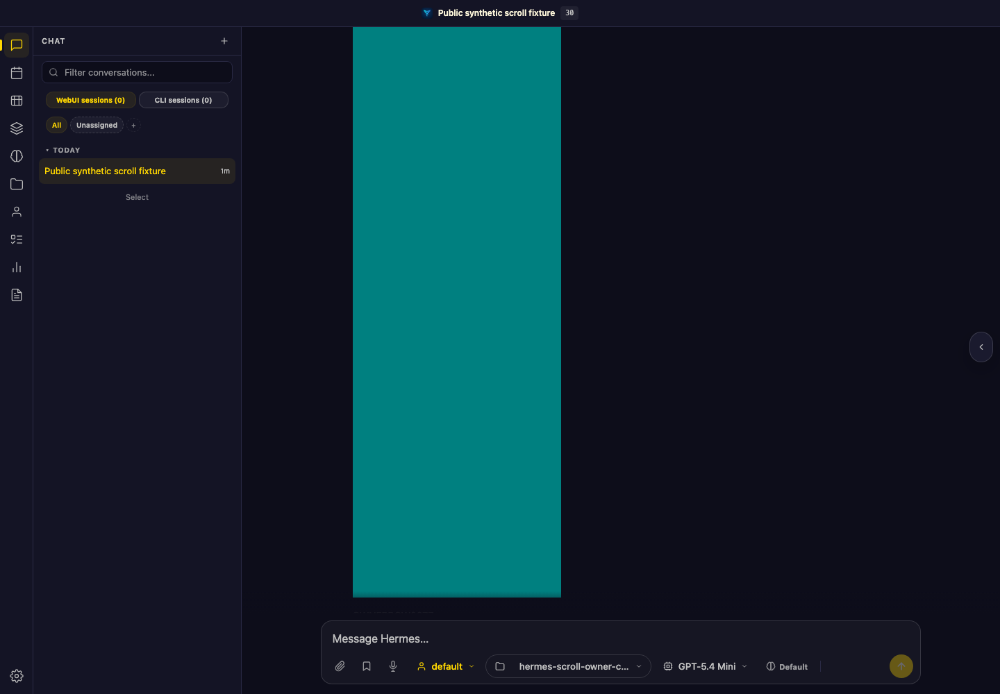
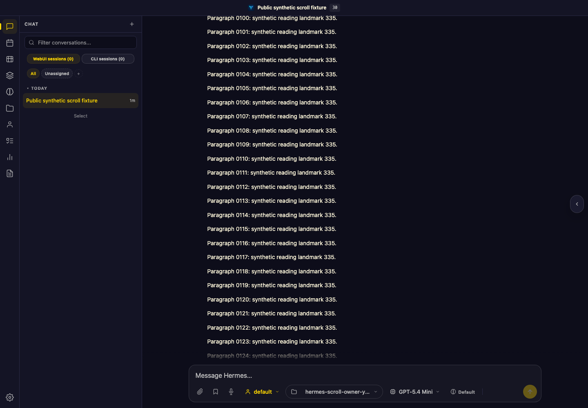
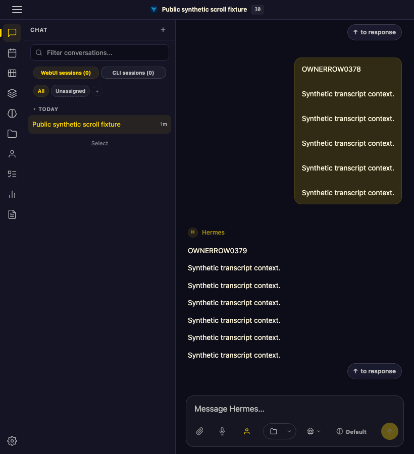
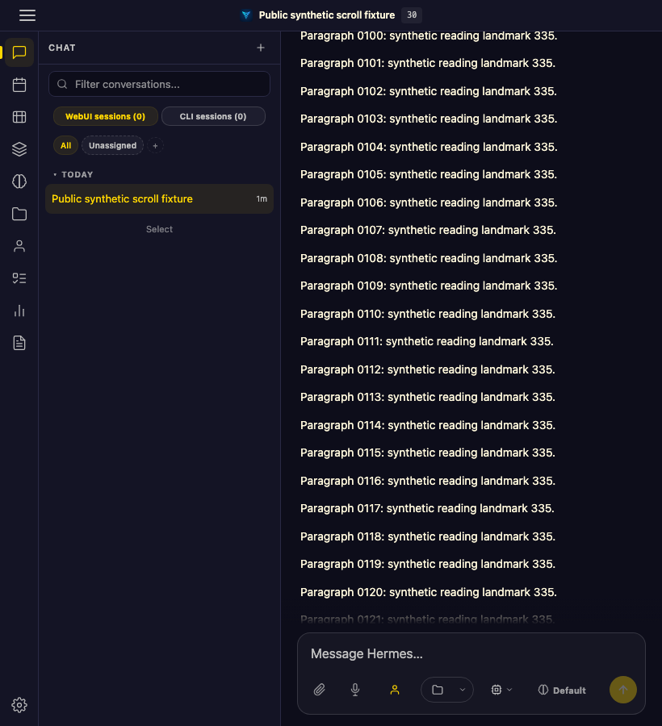
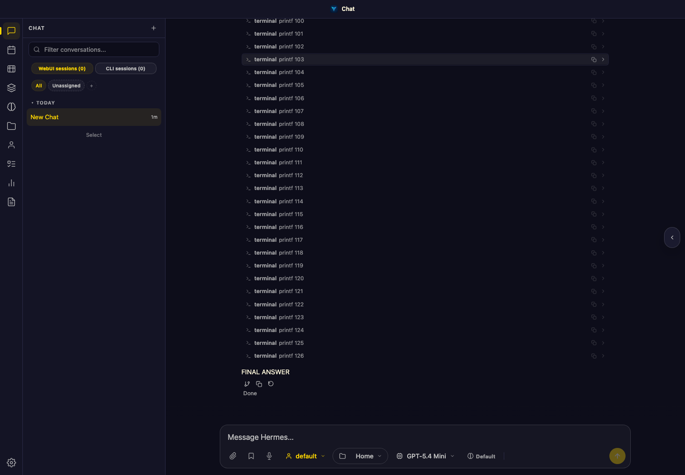
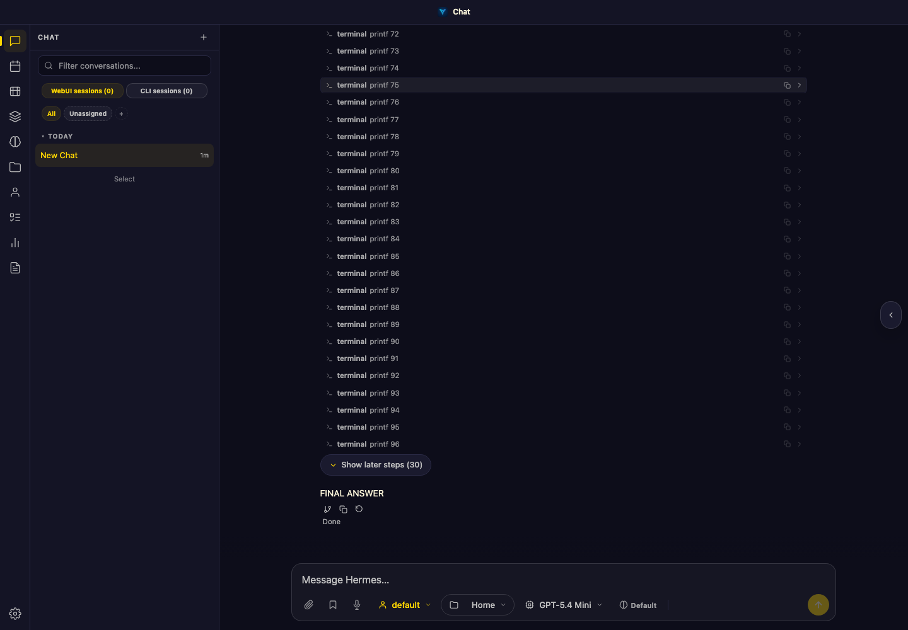
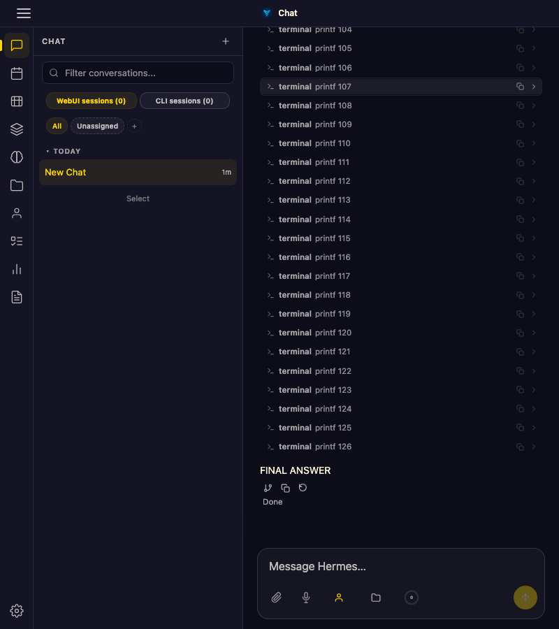
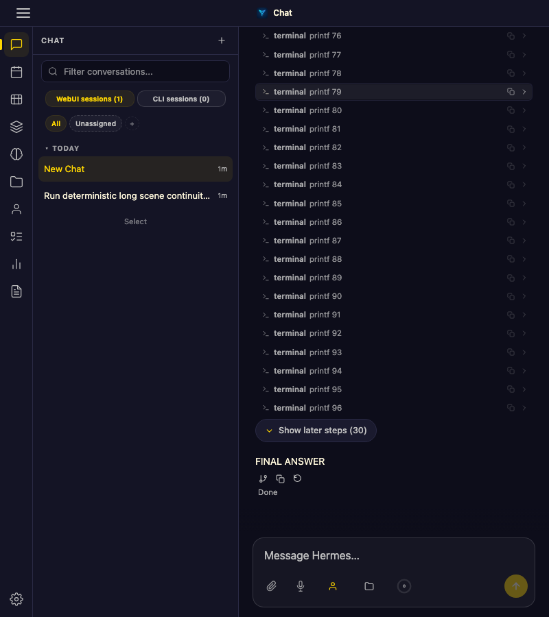
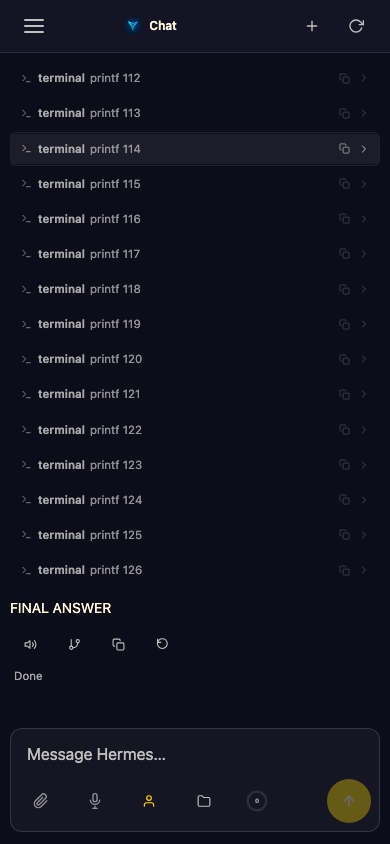
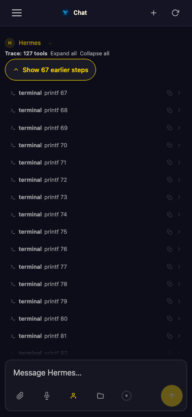

# Transcript window ownership

## Problem and scope

Opted-in transcript virtualization can move the content under a reader while
mounting rows, prepending older history, or measuring newly laid-out content.
Position restoration must follow the painted content, not just `scrollTop` or
an estimated spacer height. Issue #7591 tracks the user-visible failure.

This implementation changes browser projection state in `static/ui.js` and the
prepend handoff in `static/sessions.js`. It does not change server persistence,
message pagination semantics, SSE events, activity-mode defaults, or the
`virtualize_transcript` default. It was extracted onto upstream `06d28c08`, not
submitted as a merge of the divergent development fork.

## Ownership

- `_messageWindowSnapshot` captures a painted source row or activity projection,
  including a within-content landmark and session-relative source index.
  Hidden or clipped activity cannot own the viewport.
- `_currentMessageVirtualWindow` retains that reader and distinguishes measured
  zero from an unknown height. Compact/hidden projections align assistant turns
  to preserve grouping. Transparent Stream instead windows individual source rows
  so a large turn cannot expand the source window without bound.
- `_loadOlderMessages` retains its existing request/session validation. It samples
  the reader after fetch completion and passes it into the owned prepend path.
- `_commitMessageWindow` stages rows off-DOM, inserts before removal, reuses
  unchanged keyed rows on window shifts, and performs one reader compensation.
  Reuse compares complete staged markup, not identity alone.
- Activity disclosure storage uses a session-relative source key on the legacy
  assistant-history path. `ensureActivityGroup` consumes the optional key and
  restore flag; callers not opting into this keep their existing behavior.
- `_reconcilePreservedLiveTurn` preserves upstream's parser-tail and structural
  superset decisions, but resolves the rebuilt turn inside the staged root.
- A page-lifetime ResizeObserver owns the reader snapshot. Session identity,
  message-array identity, render revision, input epoch, and position gate its
  use. New renders replace the snapshot; mismatched state cannot restore an old
  reader. The virtual scheduler coalesces one rAF and stops when its key is stable.
- Programmatic-scroll freshness suppresses follow interpretation, not mounting
  required by subsequent real input. Blank recovery requests an owned window
  update instead of recursively switching to a full transcript render.
- Markdown cache identity uses the complete input; the existing entry-count
  bound remains. Equal-length messages sharing a prefix and suffix must not
  paint one another's bodies.

Other settled anchor-scene disclosure identity policies are not redesigned here.
The optional disclosure handling supports the legacy-history owner used by this
change. Ordinary render/cache paths initialize the same reader ownership state.

## Verification on the upstream port

The independent browser gate serves actual app code with synthetic session/SSE
transport and isolated state. Pagination uses AST-extracted production message
window helpers. Candidate and baseline JS are frozen for each run. The oracle
checks painted content, offsets inside content, content identity, input travel,
blank frames, and mounted-row limits; failures remain failures.

Final source hashes and case results are in
[`results.json`](../images/transcript-scroll-owner/results.json). `head` in those
records is the pre-commit base; **source hashes identify the tested candidate**.

- Focused affected tests: **158 passed**.
- Broader 68-module neighbor selection: **703 passed, 1 skipped**. Selections
  overlap; these counts must not be added together.
- Text/lifecycle browser matrix: **60/60 passed**, Chromium and WebKit at
  desktop (1440x1000), narrow (820x900), and mobile (390x844).
- Synthetic tool-history activity prepend and trusted-wheel traversal:
  **12/12 passed**, both engines at all three widths.
- Same late-image oracle against upstream `06d28c08`: desktop failed with
  **884 px** landmark movement. Narrow/mobile controls failed earlier with a
  missing content landmark; they are not equivalent drift measurements.
- Cache-identity regression: **3/3 fail on base**, **3/3 pass on candidate**.
- Before the optional disclosure-key consumer was added to the extraction,
  desktop/mobile activity prepend failed. The unchanged composed tests passed
  after that dependency was restored.

Reproduce after preparing the repository test environment and installing
Playwright browsers according to `TESTING.md`:

```bash
BROWSERS=chromium,webkit VIEWPORTS=desktop,narrow,mobile \
  .venv/bin/python tests/browser_transcript_scroll_owner.py \
  --cases continuity,identity,prepend,input,switch,image,cold,stream,cache,disclosure

SCROLL_FIXTURE=tools BROWSERS=chromium,webkit VIEWPORTS=desktop,narrow,mobile \
  .venv/bin/python tests/browser_transcript_scroll_owner.py \
  --cases activity,natural --artifacts /tmp/hermes-scroll-tools

BROWSERS=chromium VIEWPORTS=desktop \
  .venv/bin/python tests/browser_transcript_scroll_owner.py \
  --baseline-ref 06d28c08 --cases image --artifacts /tmp/hermes-scroll-before
```

Neighbor selection: run `./scripts/test.sh` over `tests/test_*.py` whose filenames
contain `scroll`, `virtual`, `worklog`, `anchor`, or `disclosure`. The focused
selection additionally includes cache identity and midstream-flicker guards.

### Public synthetic screenshots

These are end-of-test screenshots, not proof of continuous motion. The desktop
pair shows different outcomes of the same late-image test. The narrow baseline
failed before finding its intended landmark, which explains the different row.
All screenshots contain generated fixture data only.

| Viewport | Before | After |
| --- | --- | --- |
| Desktop |  |  |
| Narrow |  |  |

## Source-history follow-up verification

The reporter confirmed the development-fork replacement scrolls well in the
actual browser, with virtualization enabled. That is separate evidence from
these upstream-port tests.

A live tool-heavy **Transparent Stream** trial of the published scroll-owner
replacement exceeded its mounted-row acceptance bound, reaching **555 observed
rows**. The follow-up source-window candidate addresses whole-turn expansion,
per-source tool ownership after prepend, and mount-dependent historical scene
aggregation. Browser-synthesized scenes are tracked by weak object identity;
server-supplied scenes remain authoritative and are not replaced with inferred
legacy metadata. Final-answer classification uses the full source list rather
than the mounted window edge.

The source-history follow-up passes the unchanged natural traversal gate on
Chromium/WebKit at desktop, narrow, and mobile widths:

- Oversized public 4-turn × 240-tool history: **6/6**, at most **146** observed rows.
- Ordinary public 12-turn × 55-tool history: **6/6**, at most **137** observed rows.
- Original private reproduction: **6/6**, at most **155** observed rows; only
  aggregate results are reported, never private transcript artifacts.
- Compact activity/prepend/traversal: **12/12**; hidden oversized traversal: **6/6**.
- Text/lifecycle matrix rerun: **60/60**.
- Broader 90-module neighboring selection: **959 passed, 2 skipped**.

The WebKit backward jump was isolated to a collapsed card's unpainted paragraph
being selected as a landmark. Snapshot selection now clips descendants as well
as candidate rows. Repeated tool IDs additionally require an exact source owner
when replacing a detached card; disclosure identity alone is insufficient.
Leading reasoning belongs to its following source, transparent event margins
participate in measurement, and snapshot geometry/style reads are cached only
within one synchronous capture. These have executed failing-before/passing-after
regressions, independent of the composed traversal gate.

[Follow-up public results and source hashes](../images/transcript-scroll-owner/transparent-results.json)
identify the tested production bytes. Earlier `results.json` above records the
original port, not this follow-up. Final synthetic images:
[desktop](../images/transcript-scroll-owner/transparent-desktop.png) and
[mobile](../images/transcript-scroll-owner/transparent-mobile.png).

The strict browser oracle checks the initial snapshot, sampling frames, and idle
state as well as motion; the observed-row bound remains below 190. Run both
ordinary and oversized public tool turns with an explicit activity mode:

```bash
SCROLL_ACTIVITY_MODE=transparent_stream SCROLL_FIXTURE=tools \
  SCROLL_TOOL_TURNS=4 SCROLL_TOOL_STEPS=240 \
  BROWSERS=chromium,webkit VIEWPORTS=desktop,narrow,mobile \
  .venv/bin/python tests/browser_transcript_scroll_owner.py \
  --cases natural --artifacts /tmp/hermes-transparent-bound
```

## Server-scene navigation and publication verification

The separate server-scene path now uses bounded earlier/later pages rather than
materializing an omitted prefix. The normal page is 30 rows (10-row slack); a
shared budget reduces pages when multiple canonical server scenes are loaded.
The budget derives from source owners, not transient mounted DOM. All normalized
canonical rows remain accessible in order, and final prose and full tool counts
remain outside the page selection. Expand/collapse changes only mounted details;
it does not navigate. Scene-object WeakMap state survives same-scene rebuilds
and is invalidated by replacement of the scene or its row array. Click handlers
resolve the segment's current source index after reindexing.

The just-settled exemption is removed. Session-list idle reconciliation preserves
the live DOM until the transcript replacement owns its removal. A stream-qualified
scene-row snapshot retains an unpinned reader through settlement; the existing
input/session guards still reject stale restores. Approval/clarification cleanup
must not infer follow from a small bottom gap when the reader explicitly unpinned.

Publication checks on the combined production sources:

- Server-scene earlier/later navigation, complete 127-row access, cache rehydration,
  expand/collapse, error details, replacement, and actual local Gateway/SSE
  live-to-settled continuity: Chromium/WebKit × desktop/narrow/mobile, **6/6**.
- A 140-source-row / 70-scene-owner fixture exercises cold mount, virtual remount,
  prepend, same-index replacement and reindexed clicks with the unchanged **<190**
  row oracle, in both engines at all three widths.
- Source precedence regression fails before the fix: an earlier duplicate
  content-prefix key must not override the exact session-relative source. Only
  an unambiguous fallback may compensate when that source is absent.
- Combined-source reruns: **6/6** oversized transparent, **6/6** original private
  reproduction, **12/12** compact, **6/6** hidden, **60/60** text/lifecycle.
- Targeted 115-module local suite: **1,218 passed, 28 skipped**. This selection
  includes scene browser gates and approval/clarification/idle-state neighbors.

[Publication results and tested source hashes](../images/transcript-scroll-owner/publication-results.json)
keep this evidence separate from earlier source revisions. CI runs the two new
scene scripts through `tests/test_transparent_scene_pages_browser.py`, using the
installed Chromium engine; local runs request both engines.

```bash
BROWSERS=chromium,webkit ./scripts/test.sh -q tests/test_transparent_scene_pages_browser.py
```

### Scene navigation before/after (synthetic)

The baseline reveal mounts all 127 rows; after navigation replaces one bounded
page. Screenshots illustrate controls, not continuous-motion proof.

| Width | Before | After |
| --- | --- | --- |
| Desktop |  |  |
| Narrow |  |  |
| Mobile |  |  |

## Native anchoring transaction release

Owned commits suppress native overflow anchoring only while mutating and
compensating the transcript. A `finally` block flushes transaction layout, then
restores the exact previous inline value and priority before yielding. This
preserves touch CSS `auto`, desktop CSS `none`, and any pre-existing mobile or
shared suppression owner; nested synchronous commits do not create a competing
asynchronous release.

The frozen pre-fix build fails the touch resting-anchor browser assertion.
Executed regressions cover success, insertion/restore/ownership exceptions,
nested commits, prior empty/auto/none values, inline priority, overlapping shared
and mobile suppression, and late image growth after input invalidates the JS
snapshot. Chromium touch retains the reader within one pixel; desktop remains
native-anchoring disabled by CSS. The browser regression runs through pytest.
Both-engine desktop/narrow/mobile reruns pass oversized natural traversal (6/6)
and the text/lifecycle matrix (60/60). [Tested source hashes and results](../images/transcript-scroll-owner/native-anchor-results.json)
identify this follow-up separately from the earlier evidence.

## Scope limits

The total transcript bound is an opted-in virtualization contract, not a promise
for virtualization disabled. Scene paging bounds each disclosure even when it is
disabled, but does not window the entire list. Live streaming rows before settlement
are not newly virtualized by this change. Scene-owner count changes can resize the
shared page budget; the executed prepend case covers 70→71 owners, not every budget
boundary. These limits are explicit rather than a claim of universal bounded DOM.

Physical-device touch momentum, real provider/network
reconnect, browser auth-on behavior, and
composition with open PRs #7280/#7283 were not certified here. Live reconciliation
coverage uses synthetic transport and checks parser connectivity, not provider
reliability. Fork-only completion/reconnect scripts are not part of this port
and their historical passes are not counted above.

Related work: #6151/#6155 discuss default-on virtualization and performance;
#7280 addresses synchronous post-process drift; #7283 addresses height-estimator
calibration. This change does not claim to supersede those proposals or authorize
a default change. Keep #7591 open pending upstream integration.
