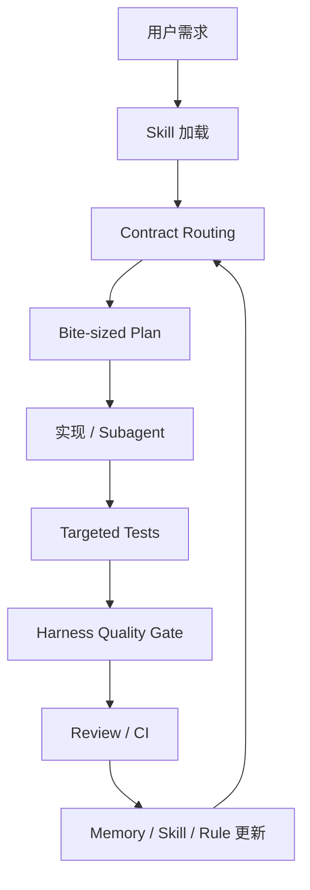

# Agentic Engineering / Harness Engineering 中文落地方案

> 状态：决策版 v0.1
> 来源：基于用户提供的两篇微信文章整理，并结合 Hermes Agent / Hermes WebUI 当前工程机制形成。
> 对应英文实施文档：`docs/harness-engineering.md`
> 本文目标：把“文章观点”整理成 Hermes 本地可执行、可演进、可验证的工程方案。

---

## 1. 一句话结论

**不要把 AI 当成一个更快的临时程序员，而要把 AI 放进一套工程安全带里。**

这套安全带就是 Harness Engineering：

- 用规则限定 AI 该读什么、该改什么、不能碰什么；
- 用计划把需求拆成可验证的小任务；
- 用测试、lint、smoke、截图、PR 证据证明结果；
- 用 Skill / Memory / 文档把经验沉淀下来；
- 用 Hook / CI / Plugin / MCP 把重复提醒变成可执行机制。

最终目标不是“AI 能不能跑通一次”，而是：

> **AI 每次交付都必须经过同一套合同路由、质量证据和知识复用流程。**

---

## 2. 从 Vibe Coding 到 Harness Engineering

### 2.1 Vibe Coding 的典型状态

Vibe Coding 的工作方式是：

1. 人给 AI 一个目标；
2. AI 猜实现方案；
3. 报错后继续让 AI 修；
4. 直到“看起来能跑”；
5. 经验停留在当前对话里，下次重新开始。

这种方式在 demo、原型、小脚本阶段很快，但进入真实项目后会暴露问题：

| 问题 | 表现 |
|---|---|
| 上下文丢失 | 新会话不知道项目规则、历史坑、用户偏好 |
| 质量靠提醒 | “记得测试、记得安全、记得更新 changelog”全靠人脑 |
| 安全不可见 | AI 完成了功能，但没有检查注入、权限、密钥、状态污染 |
| 经验不可复用 | 一次复杂排查成功后，没有沉淀成下次可调用的流程 |
| 验证不稳定 | 经常只说“修好了”，没有可复现证据 |

### 2.2 Harness Engineering 的目标状态

Harness Engineering 不是让 AI “更聪明地猜”，而是让 AI **被工程体系约束着做事**。

每个非简单任务都要回答：

1. **适用什么合同？** 例如 `docs/CONTRACTS.md`、`TESTING.md`、RFC、UI/UX 指南。
2. **要先读哪些规则？** README、CONTRIBUTING、架构文档、子系统文档。
3. **怎么拆任务？** 是否需要 bite-sized plan，是否需要 TDD。
4. **怎么证明完成？** pytest、ruff、JS lint、browser smoke、截图、负向测试。
5. **哪些经验要沉淀？** Memory 存事实，Skill 存流程，Rules/CI 存硬约束。
6. **下次如何自动化？** Hook、CI、Plugin、MCP、Cron、Webhook 或 Knowledge Graph。

---

## 3. Hermes 本地九类机制映射

Hermes 已经具备做 Harness Engineering 的底层能力，只是需要把它们组合成统一工作流。

| 机制 | Hermes 中的对应物 | 作用 | 本地落地例子 |
|---|---|---|---|
| Hook | Git hook、shell hook、CI workflow、WebUI/API 事件 | 在关键触发点执行检查 | pre-commit 做语法检查，pre-push 做 diff 测试 |
| Subagent | `delegate_task`、Codex/Claude/OpenCode worker、Kanban worker | 把实现、测试、安全、UI 评审拆开 | 实现 agent + 测试 reviewer + 安全 reviewer |
| Skill | `~/.hermes/skills`、仓库内 skill | 复用流程经验 | WebUI debug、质量门禁、合同路由 |
| Rules | `AGENTS.md`、`CONTRIBUTING.md`、`docs/CONTRACTS.md`、RFC | 声明式硬规则 | 不能泄密、要更新 changelog、保护 session invariant |
| MCP | `hermes mcp`、外部工具桥 | 把 GitHub、浏览器、设计工具等接入 agent | PR 检查、浏览器 QA、issue 查询 |
| Plugin | `hermes plugins` | 把能力产品化、工具化 | Harness quality gate plugin |
| Memory | `MEMORY.md`、`USER.md`、session search | 跨会话稳定事实 | 用户偏好、环境坑、项目稳定约定 |
| Cron/Webhook | `hermes cron`、`hermes webhook` | 定时或事件驱动检查 | 每周文档漂移检查、PR opened 自动审计 |
| State/Knowledge Graph | SQLite session、state DB、skill usage、代码/测试索引 | 维护长期工程上下文 | 文件 → 合同 → 测试 → invariant 映射 |

---

## 4. Hermes WebUI 默认工程规则

### 4.1 编辑前必须做

非 trivial 任务开始前，AI 默认应执行：

1. 确认当前 workspace。
2. 加载相关 skill。
3. 读取项目入口文档：
   - `README.md`
   - `CONTRIBUTING.md`
   - `docs/CONTRACTS.md`
   - `CHANGELOG.md`
4. 根据改动范围读取子系统文档：
   - 架构/setup/testing：`ARCHITECTURE.md`、`TESTING.md`
   - UI/UX：`docs/UIUX-GUIDE.md`、`DESIGN.md`
   - runtime / streaming / compression / session：对应 RFC
5. 说明 contract family。
6. 如果是多步骤任务，先写 bite-sized plan。

### 4.2 编辑中必须遵守

1. 一个 PR 只做一个逻辑变更。
2. 优先沿用现有技术栈：Python + vanilla JS；不轻易引入新框架/依赖。
3. 保护 prompt-cache、session、streaming、state recovery 等 invariant。
4. setup/onboarding 相关验证必须使用隔离状态目录，避免污染真实 `~/.hermes`。
5. 不打印 secret、完整 `.env`、cookie、token、password hash。
6. 行为变更尽量配测试。
7. 用户可见变化更新 docs / changelog。

### 4.3 完成前必须给证据

| 改动类型 | 至少需要的证据 |
|---|---|
| Python 行为 | targeted pytest + regression test |
| 静态 JS | `npm run lint:runtime` 或说明跳过原因 |
| UI/UX | 截图/视频 + desktop/narrow/mobile 说明 |
| runtime/streaming/recovery | 指明状态层 + invariant 测试或手动 replay |
| setup/onboarding | 隔离 `HERMES_HOME` / `HERMES_WEBUI_STATE_DIR` 证明 |
| security-sensitive | 风险说明 + 负向测试或手动 abuse case |
| docs-only | 链接/内容检查 + changelog 决策 |

---

## 5. 已完成的本地落地

当前已经做完第一批落地，不只是总结。

### 5.1 方法论文档

已新增英文方案：

```text
docs/harness-engineering.md
```

内容包括：

- Vibe Coding 的问题；
- Harness Engineering 定义；
- Hermes 九类扩展机制映射；
- 默认编程规则；
- 质量证据矩阵；
- Subagent 角色模型；
- Skill / Memory 策略；
- Hook / CI / MCP / Plugin / Knowledge Graph 路线。

### 5.2 Advisory 质量门禁脚本

已新增：

```text
scripts/harness_quality_gate.py
```

它目前是 **advisory 模式**，不会阻断提交，只负责根据 changed files 生成技术路由、推荐检查，并在 `--run-fast` 下执行 bounded fast checks。

当前能力：

- 读取 git changed files，包括 staged、unstaged、untracked；
- 支持 `--files` 显式传入文件列表；
- 自动分类 touched areas：Python、frontend、UI/UX、docs、tests、changelog、setup、runtime state、security；
- 映射相关 contract docs；
- 输出默认 `## Harness Technical Gate` 区块；
- 支持 `--format json`，便于 CI / Plugin / WebUI 消费；
- 推荐检查命令；仅在使用 `--run-fast` 时执行 bounded fast checks。

示例：

```bash
python3 scripts/harness_quality_gate.py --base origin/master
python3 scripts/harness_quality_gate.py --files 'server.py,static/app.js,tests/test_example.py'
python3 scripts/harness_quality_gate.py --files 'server.py,tests/test_example.py' --format json
python3 scripts/harness_quality_gate.py --base origin/master --run-fast
```

### 5.3 测试覆盖

已新增：

```text
tests/test_harness_quality_gate.py
```

覆盖：

- 文件分类；
- 合同路由；
- 推荐检查；
- Markdown technical gate 输出；
- `--files` 模式。

已验证通过：

```text
pytest: 5 passed
py_compile: passed
quality gate markdown/json smoke: passed
```

### 5.4 Release Notes

普通贡献 PR 不直接编辑：

```text
CHANGELOG.md
```

若变更值得进入发布说明，在 PR body 中提供 release-note-ready wording，由 release workflow 统一写入 changelog。

---

## 6. Subagent 分工模型

复杂任务不应该由一个 agent 从头做到尾。推荐拆为以下角色：

| 角色 | 职责 | 禁止事项 |
|---|---|---|
| Contract Router | 判断适用文档、规则、证据 | 不直接写代码 |
| Planner | 拆成 bite-sized tasks | 不跳过测试 |
| Implementer | 聚焦实现 | 不私自扩大范围 |
| Test Writer | 写回归/验收测试 | 不 rubber-stamp 现状 |
| Security Reviewer | 查注入、泄密、权限、状态污染 | 不认为测试绿就安全 |
| UI Reviewer | 验证视觉和响应式证据 | 不接受“看起来可以” |
| Release-note Reviewer | 检查 release-note wording/docs 是否诚实 | 不为不可见内部改动乱写 release note |

每个任务的两阶段评审：

1. **Spec compliance review**：是否满足任务和合同要求；
2. **Code quality review**：是否最小、可维护、已测试、安全。

---

## 7. 分阶段路线图

### Phase 0：文档化 Harness

状态：基本完成。

已做：

- 新增 `docs/harness-engineering.md`；
- 新增本文中文总结 `docs/harness-engineering-cn.md`；
- 形成质量证据矩阵；
- 形成 contract routing / technical gate 的基本格式。

下一步：

- 决定是否把该文档长期保留在 `docs/`；
- 把关键规则同步到 `AGENTS.md` / `CONTRIBUTING.md` / 技术门禁脚本。

### Phase 1：本地 advisory quality gate

状态：初版已完成。

已做：

- `scripts/harness_quality_gate.py`；
- `tests/test_harness_quality_gate.py`；
- 脚本 smoke / pytest / ruff / py_compile 验证。

下一步增强：

1. 完成 WebUI 前置调用，使工程类请求在进模型前带上技术路由；
2. 保持 advisory 默认，不立刻阻断开发。

### Phase 2：WebUI advisory preflight

WebUI 在模型前做一次 advisory preflight，把工程类请求附上技术路由；
失败必须 fail open，不能阻断普通聊天，也不能改写用户可见文本。

实现位置：`api/streaming.py`。
覆盖：`tests/test_harness_webui_preflight.py`。

### Phase 3：CI technical gate

等本地试用稳定后，再把技术门禁放进 GitHub Actions。

要求：

- 使用 `python3 scripts/harness_quality_gate.py --base origin/master --run-fast`；
- 只处理低噪声技术失败，例如 whitespace 或 Python syntax；
- 不替代常规测试矩阵、browser smoke 或 reviewer 选择的子系统测试；
- 保持 `contents: read` 最小权限。

### Phase 4：Pre-commit / Pre-push Hook

目标：如果技术门禁本身足够稳定，再把低成本检查前移到本地。

建议：

- `pre-commit`：语法检查、Python compile、JS runtime lint；
- `pre-push`：diff-scoped ruff + affected pytest；
- `commit-msg`：contract-affecting commit 缺 docs/test 时警告。

原则：

- 初期允许带理由 bypass；
- 不要一开始就设置过重，避免团队绕开。

### Phase 5：MCP / Plugin 化

目标：把 Harness 变成 Hermes 的可调用能力。

可能工具：

- `harness.route`：输入 diff，输出 contract routing；
- `harness.check`：执行或推荐检查；
- browser QA MCP：自动截图、console error 检查。

### Phase 6：Knowledge Graph / State

目标：让 AI 能回答：

> “如果我改这个文件，需要遵守哪些合同、跑哪些测试、保护哪些 invariant？”

需要建立映射：

```text
source files → contract docs → tests → invariants → known pitfalls → owners/history
```

---

## 8. Skill / Memory 沉淀策略

### 8.1 Memory 只存稳定事实

适合 Memory：

- 用户偏好；
- 环境稳定事实；
- 项目长期约定；
- 反复纠正过、未来仍会影响行为的偏好。

不适合 Memory：

- PR 号、issue 号、commit SHA；
- “修了某 bug”这类会过期的任务记录；
- 临时进度；
- 一周内可能失效的事实。

### 8.2 Skill 存可复用流程

适合 Skill：

- 5+ 工具调用才摸清的复杂流程；
- 成功解决过的 tricky debugging path；
- 项目专属质量流程；
- 加载过的 skill 被发现缺步骤/过时后补丁更新。

推荐新增/沉淀的 skills：

1. `software-development/harness-engineering`
   把本文方法论变成 AI 可加载的工作规则。

2. `software-development/hermes-webui-quality-gate`
   保存 WebUI PR 质量门禁命令、证据矩阵和已知坑。

3. `software-development/hermes-contract-routing`
   专门做 changed-file → contract docs → evidence 的轻量路由。

4. `github/hermes-pr-evidence`
   生成/检查 PR 描述里的 Thinking Path、Verification、Risks、Model Used、Contract Routing。

---

## 9. 立即可执行的下一步

建议按这个顺序继续：

### Step 1：把中文总结纳入文档索引

- 在 `docs/harness-engineering.md` 顶部互链中文版本；
- 在中文版本顶部互链英文实施文档；
- 在 README 或开发文档中加一个链接入口。

### Step 2：把 advisory gate 再增强一层

给 `scripts/harness_quality_gate.py` 增加：

```bash
--format json
--run-fast
```

- `--format json`：方便 CI / Plugin / WebUI 消费；
- `--run-fast`：只跑安全快速检查，例如 py_compile、ruff wrapper、lint dry-run。

### Step 3：生成 PR template / PR body checker

PR 必须包含：

```markdown
## Thinking Path
## Contract Routing
## Verification
## Risks / Rollback
## Model / Agent Used
```

先检查格式，不立即阻断。

### Step 4：沉淀成 Skill

创建：

```text
software-development/harness-engineering
```

让以后每次遇到复杂工程任务时，Hermes 自动加载这套规则，而不是靠当前会话记住。

### Step 5：试运行一个小 PR

选一个低风险 WebUI 小改动，让完整链路跑一遍：

```text
contract routing → plan → implementation → targeted tests → harness evidence → PR template
```

只有试运行顺畅后，再考虑 Hook / CI required gate。

---

## 10. 四条可迁移原则

这套方法不只适用于 Hermes，也适用于任何 AI-assisted development 项目。

1. **把提醒变成门禁**
   如果团队重复说“记得做 X”超过两次，就应该把 X 编码成 hook、script、CI、skill 或 checklist。

2. **把生成和验证分离**
   写代码的 agent 不应该是唯一验收者。至少要有 spec、quality、security、UI evidence 的独立检查。

3. **先路由合同，再编辑代码**
   每个项目都有隐形合同。AI 改代码前必须知道适用哪些文档、规则和证据要求。

4. **知识放到正确层级**
   - 事实 → Memory；
   - 流程 → Skill；
   - 临时进度 → Session；
   - 硬约束 → Rules / Hook / CI；
   - 外部系统能力 → MCP / Plugin。

---

## 11. 最终目标图



目标不是让 AI 每次都“发挥得好”，而是让 AI 即使换模型、换会话、换平台，也能沿着同一套工程轨道稳定交付。

---

## 12. 当前状态摘要

| 项目 | 状态 |
|---|---|
| 英文方法论/实施计划 | 已完成：`docs/harness-engineering.md` |
| 中文决策版总结 | 已完成：`docs/harness-engineering-cn.md` |
| Advisory quality gate | 已完成：`scripts/harness_quality_gate.py`，支持 markdown/json 和 `--run-fast` |
| WebUI preflight bridge | 已完成：`api/streaming.py`，仅改写 model-facing current turn，不污染可见/持久化用户消息 |
| CI technical gate | 暂不落地；等本地试运行低噪声后再考虑 GitHub Step Summary |
| Gate 测试 | 已完成：`tests/test_harness_quality_gate.py`、`tests/test_harness_webui_preflight.py` |
| Changelog | 未直接编辑；release-note-worthy wording 放在 PR body |
| 下一步 | 试运行 `--run-fast` 和 WebUI preflight；稳定后再考虑本地 hook 或 required gate |
