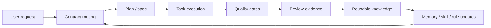

# Hermes Harness Engineering Plan

> Status: Draft v0.1 — methodology and implementation plan, no runtime behavior change.
>
> Chinese decision summary: `docs/harness-engineering-cn.md`.
>
> Source context: synthesized from two WeChat articles supplied by the user:
> - `Vibe Coding 死了，Agentic Engineering 来了`
> - `从 Vibe Coding 到 Harness Engineering：GitHub 195k ECC (Everything Claude Code) 项目详解`

## 1. Goal

Move Hermes-assisted development from **vibe coding** — “ask an AI to try until it runs” — to **Harness Engineering**: engineering discipline encoded as executable agent behavior.

Harness Engineering means that safety checks, coding standards, testing flow, knowledge reuse, review routing, and cross-session memory are not optional reminders. They become a programmable harness around every AI coding task.

For Hermes WebUI and Hermes Agent, this plan turns the existing strengths — skills, memory, cron, profiles, toolsets, MCP, plugins, webhooks, and subagent orchestration — into a repeatable team-grade development system.

## 2. Why Vibe Coding Is No Longer Enough

The article synthesis highlights four recurring failure modes:

1. **Context loss** — every conversation starts from zero unless rules, skills, plans, and memory are loaded consistently.
2. **Human-memory quality gates** — “remember to test”, “remember to check security”, “remember the project contract” fails under speed and fatigue.
3. **Invisible security gaps** — AI implements what was requested, not the unstated threat model.
4. **Non-reusable knowledge** — lessons from one bug, PR, project, or platform stay trapped in a transcript.

Hermes already has many primitives to solve these, but they need to be wired into a unified workflow.

## 3. Harness Engineering Definition for Hermes

Harness Engineering is the practice of converting engineering rules into executable assistant behavior across the full development loop:



The harness must answer these questions for every non-trivial change:

- **What contract applies?** (`docs/CONTRACTS.md`, RFCs, UI/UX guide, testing docs)
- **What rule set applies?** global, project, subsystem, task-specific
- **What evidence proves done?** tests, lint, browser smoke, screenshots, manual invariants
- **What must be remembered?** durable preference/machine fact vs reusable workflow skill vs temporary transcript detail
- **What should be automated next time?** hook, plugin, MCP tool, skill, cron, or subagent pattern

## 4. Nine Extension Mechanisms and Their Role

The articles discuss a Claude Code ecosystem with Hook, Subagent, Skill, Rules, MCP, Plugin, and state primitives. Hermes can implement the same pattern with its own native mechanisms.

| Mechanism | Hermes analogue | Primary job | Example for this repo |
|---|---|---|---|
| Hooks | Git hooks, shell hooks, CI workflows, WebUI/API event hooks | Enforce non-negotiable checks at trigger points | pre-commit runs syntax + targeted lint; pre-push runs affected tests |
| Subagents | `delegate_task`, spawned Hermes/Codex/Claude/OpenCode workers, Kanban workers | Split work and review into isolated roles | implementer, spec reviewer, security reviewer, UI evidence reviewer |
| Skills | `~/.hermes/skills` and in-repo `skills/` | Reusable procedural knowledge | “debug WebUI streaming”, “author in-repo skill”, “requesting code review” |
| Rules | `AGENTS.md`, `CONTRIBUTING.md`, `docs/CONTRACTS.md`, subsystem docs, skill triggers | Declarative constraints loaded before work | no build step, vanilla JS, one logical PR, docs/changelog updates |
| MCP | `hermes mcp` servers and native tool bridges | Bring external systems into the agent tool surface | GitHub, browser QA, design tools, issue trackers, code search |
| Plugins | `hermes plugins` | Package reusable capabilities with config/tooling | technical quality gate plugin, repository policy plugin |
| Memory | `MEMORY.md`, `USER.md`, session search | Durable facts and cross-session recall | user preferences, environment quirks, stable project facts |
| Cron / Webhooks | `hermes cron`, `hermes webhook` | Scheduled or event-driven checks | nightly docs drift audit, weekly skill hygiene, PR opened quality audit |
| State / Knowledge graph | SQLite sessions, state DB, skill usage, optional code graph | Maintain continuity and queryable project context | task lineage, known invariants, flaky test history, ownership map |

## 5. Unified Programming Rules for Hermes Work

These should become the default rule stack for AI-assisted work in this repo.

### 5.1 Before Editing

1. Use the latest WebUI workspace tag as the working directory.
2. Read the mandatory project entry docs:
   - `README.md`
   - `CONTRIBUTING.md`
   - `docs/CONTRACTS.md`
   - `CHANGELOG.md`
3. Read subsystem docs based on the touched area:
   - Architecture/setup/testing: `ARCHITECTURE.md`, `TESTING.md`, onboarding docs
   - UI/UX: `docs/UIUX-GUIDE.md`, `DESIGN.md`
   - Runtime/streaming/recovery/compression/session metadata: relevant RFC under `docs/rfcs/`
4. Name the contract family before the first code edit.
5. For non-trivial changes, produce a bite-sized plan before implementation.

### 5.2 During Editing

1. Keep one logical change per PR.
2. Prefer existing Python + vanilla JavaScript. No new framework/build tool/dependency unless justified with rollback story.
3. Preserve existing state and prompt-cache invariants.
4. Use isolated state for onboarding/setup trials:
   ```bash
   HERMES_HOME=/tmp/hermes-webui-agent-home \
   HERMES_WEBUI_STATE_DIR=/tmp/hermes-webui-agent-state \
   HERMES_WEBUI_PORT=8789 \
   python3 bootstrap.py
   ```
5. Do not print secrets, full auth files, full `.env`, cookies, or password hashes.
6. Add or update tests for behavior changes where practical.
7. Update docs/changelog for setup, workflow, behavior, or user-visible changes.

### 5.3 Before Claiming Done

Minimum evidence matrix:

| Change type | Required evidence |
|---|---|
| Python behavior | targeted pytest + relevant regression test |
| Static JS | `npm run lint:runtime` or documented skip reason |
| UI/UX | before/after screenshots or video + desktop/narrow/mobile notes |
| Runtime/streaming/recovery | named state layer + invariant test/manual replay evidence |
| Setup/onboarding | isolated `HERMES_HOME` and `HERMES_WEBUI_STATE_DIR` proof |
| Security-sensitive | threat/risk note + negative test or manual abuse case |
| Docs-only | link/content check + changelog decision |

Default local commands:

```bash
pytest tests/ -v --timeout=60
python3 scripts/ruff_lint.py --diff origin/master
npm run lint:runtime
python tests/browser_smoke.py
```

If a command is not available locally, say so explicitly and provide the nearest verified substitute.

## 6. Subagent Role Model

For complex work, use separate agent roles rather than one monolithic “coder”.

| Role | Responsibility | Must not do |
|---|---|---|
| Contract router | Identify applicable docs/RFCs/rules and evidence | Implement code |
| Planner | Convert requirement into bite-sized implementation tasks | Skip tests because task seems small |
| Implementer | Make focused changes | Redefine scope without routing update |
| Test writer | Add regression/acceptance coverage | Rubber-stamp existing behavior |
| Security reviewer | Look for injection, secret leakage, auth/session/state risks | Assume green tests imply safe |
| UI reviewer | Verify visual/responsive evidence | Accept “looks fine” without artifact |
| Release-note reviewer | Ensure changelog/docs are honest | Add release notes for invisible internals unnecessarily |

A standard two-stage review for each task:

1. **Spec compliance review** — did the diff satisfy the stated task and contract?
2. **Code quality review** — is the implementation maintainable, minimal, tested, and safe?

## 7. Skill and Memory Policy

Harness Engineering depends on putting the right information in the right durable layer.

### Memory is for durable facts

Use memory for:

- User preferences
- Stable environment facts
- Stable project conventions
- Repeated corrections that prevent future steering

Do not use memory for:

- PR numbers, issue numbers, SHAs
- “fixed bug X” logs
- temporary task progress
- stale facts likely to expire within a week

### Skills are for reusable procedures

Create or patch a skill when:

- A workflow took 5+ tool calls and is likely to recur
- A tricky debugging path succeeded
- A loaded skill was missing a pitfall or had stale commands
- A project-specific quality process becomes repeatable

Candidate skills to add/promote:

1. `software-development/harness-engineering` — this methodology as an actionable skill.
2. `software-development/hermes-webui-quality-gate` — exact commands and technical routing matrix for WebUI PRs.
3. `software-development/hermes-contract-routing` — lightweight routing checklist tied to `docs/CONTRACTS.md`.

## 8. Hook / CI Roadmap

### Phase 0 — Document the harness

- Add this document.
- Add a technical routing checklist that mirrors the evidence matrix.
- Make the `Harness Technical Gate` output easy to copy or consume as JSON.

### Phase 1 — Local quality gate script

Initial advisory implementation: `scripts/harness_quality_gate.py`.

It currently:

- Detects changed files from git, including staged, unstaged, and untracked files.
- Accepts an explicit comma/newline-separated file list via `--files` for CI or agent use.
- Classifies touched areas into Python, frontend, UI/UX, docs, tests, changelog, setup/onboarding, runtime state, security-sensitive, Harness context, Harness context lifecycle, and Harness permission categories.
- Maps categories to relevant contract docs.
- Prints a concise `## Harness Technical Gate` block by default.
- Supports `--format json` for CI, plugin, or hook consumption.
- Recommends verification commands without executing them unless `--run-fast` is used.

Harness-specific routing mirrors the `awesome-cc-harness` pillars in Hermes terms:

| Pillar | Local gate category | Required proof |
|---|---|---|
| Context Engineering | `harness_context` | Prompt/context routing, skill or memory retention layer, and visible-vs-model-facing message boundaries. |
| Context lifecycle | `harness_context_lifecycle` | Compaction, memory, replay, or state-layer evidence rather than source inspection only. |
| Architectural Constraints | `harness_permissions` / `security` | Fail-closed approval/preflight/sandbox behavior plus a negative denial or bypass attempt. |
| Entropy Management | `gc-template` / Kanban evidence | Drift findings become triage cards with evidence and human-gated recommendations. |

This is a Hermes-native adaptation of the Claude Code harness model, not a wholesale port of Claude Code's permission modes, hook matrix, sandbox adapter, or telemetry stack.

### Permission Contract

Hermes-native permission hardening is a contract around existing runtime surfaces, not a second Claude Code permission runtime. The contract owner is the component that can actually allow, rewrite, deny, execute, persist, or dispatch the operation.

| Surface | Owner | Contract |
|---|---|---|
| Tool approval | Hermes Agent approval layer | Unknown or missing approval state must fail closed; approval checks must happen at the point of execution, not only during advisory classification. |
| WebUI preflight | `api/streaming.py` bridge | Harness rewrites may affect only the model-facing current turn; visible and persisted user text must stay unchanged. Plugin failures must not become silent permission grants for dangerous operations. |
| Gateway preflight | Hermes gateway hook dispatcher | `allow` / `rewrite` / `skip` actions remain advisory unless the gateway approval layer explicitly denies execution. |
| Toolsets and plugins | Hermes tool/plugin registry | A classifier may recommend routing, but must not enable tools, create tasks, write state, or bypass caller permission checks. |
| Cron and Kanban workers | Scheduler / board dispatcher | Durable dispatch requires explicit task state and evidence; GC or review helpers must not delete state, restart services, change credentials, or auto-dispatch workers without human approval. |
| Sandbox / shell execution | Terminal backend and approval policy | Unknown sandbox identity, missing workspace ownership, or ambiguous destructive command scope must block or request approval before execution. |

Permission-sensitive changes must include negative evidence: a denial path, bypass attempt, unknown-state case, or equivalent manual abuse case. A source-only assertion that the code "checks permission" is not enough.

Example:

```bash
python3 scripts/harness_quality_gate.py --base origin/master
python3 scripts/harness_quality_gate.py --files 'server.py,static/app.js,tests/test_example.py'
python3 scripts/harness_quality_gate.py --files 'server.py,tests/test_example.py' --format json
python3 scripts/harness_quality_gate.py --base origin/master --run-fast
```

Next hardening steps:

- Wire the gate into WebUI request preflight for engineering prompts.
- Keep advisory mode as the default until teams have trialed it on real work.
- Promote only low-noise technical checks to CI after local results are stable.

Example output:

```markdown
## Harness Technical Gate

Contract routing:
- `docs/CONTRACTS.md`
- `TESTING.md`

Recommended verification:
- `python3 scripts/ruff_lint.py --diff origin/master`
- `./scripts/test.sh tests/test_regressions.py`
```

### Phase 2 — WebUI advisory preflight

WebUI can call a Harness preflight before model dispatch and rewrite engineering
requests with technical routing context. The preflight is advisory and fails
open: plugin failures must not block normal chat or mutate visible user text.

Implemented in `api/streaming.py` with focused coverage in
`tests/test_harness_webui_preflight.py`.

### Phase 3 — CI technical gate

After local trial, add a GitHub Actions job that runs the quality gate in
technical mode and writes the `## Harness Technical Gate` summary to the GitHub
Step Summary.

Requirements before adding CI:

- run `python3 scripts/harness_quality_gate.py --base origin/master --run-fast` locally on real diffs;
- keep least-privilege `contents: read`;
- fail only on bounded technical failures such as whitespace or Python syntax errors;
- do not replace the normal test matrix, browser smoke checks, or reviewer-selected subsystem tests.

### Phase 4 — Pre-commit / pre-push hooks

Introduce opt-in local hooks after the technical gate has been trialed:

- `pre-commit`: syntax checks, Python compile, runtime ESLint when JS changed.
- `pre-push`: diff-scoped ruff + affected pytest selection.
- `commit-msg`: warn if a contract-affecting commit lacks docs/test mention.

Keep hooks easy to bypass with a documented reason; CI remains authoritative.

### Phase 5 — MCP / Plugin integrations

- MCP server for repository policy queries: “what checks apply to this diff?”
- Plugin that exposes `harness.route` and `harness.check` tools.
- Optional browser QA MCP/agent for screenshot capture and console-error assertions.

### Phase 6 — Knowledge graph and state

- Index contracts, skills, tests, and changelog entries into a lightweight graph.
- Map source files to relevant docs/tests.
- Let agents answer: “if I touch this file, what invariants and tests apply?”

## 9. Four Transferable Principles

These can be applied to any project, not only Hermes.

1. **Turn reminders into executable gates.** If the team repeats “remember to…” more than twice, encode it as a hook, script, CI check, or skill.
2. **Separate generation from verification.** The agent that writes code should not be the only agent judging correctness. Use spec, quality, security, and UI reviewers as separate roles.
3. **Route by contract before editing.** Every project has hidden contracts. Make agents name the contract family and required evidence before changing files.
4. **Persist lessons at the right layer.** Facts go to memory, procedures go to skills, temporary progress stays in session history, hard requirements go to rules/hooks/CI.

## 10. Immediate Next Actions

Recommended next order:

1. Finish the WebUI advisory preflight bridge and prove it is model-facing only.
2. Trial `scripts/harness_quality_gate.py --run-fast` on one small WebUI PR.
3. Consider opt-in local hooks if contributors find the technical gate useful.
4. Promote any strict/required checks only after real PR feedback shows low noise.

## 11. Open Questions

- Should the first gate be repo-local only, or also exposed as a Hermes plugin/tool?
- Which low-noise technical checks, if any, should become required in CI?
- Should changed-file → contract routing be maintained manually in YAML or inferred from docs/test references?
- Should WebUI have its own in-repo skill bundle, or should these remain user-local until stable?
