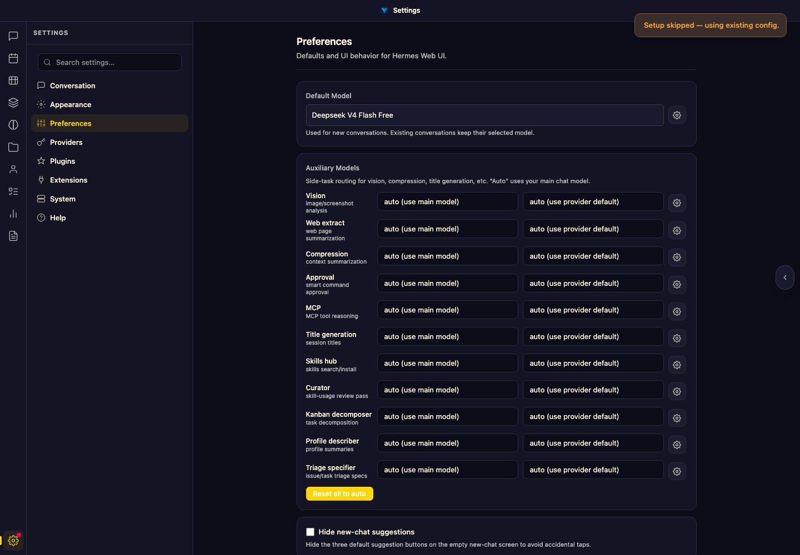
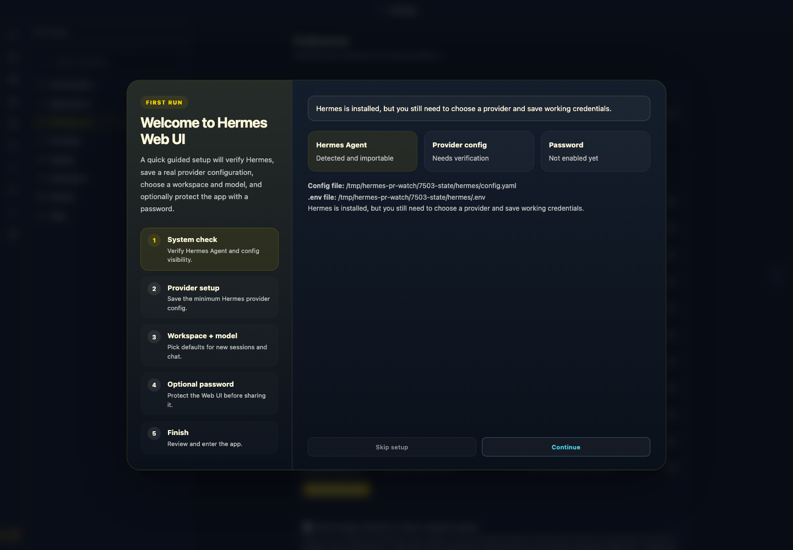
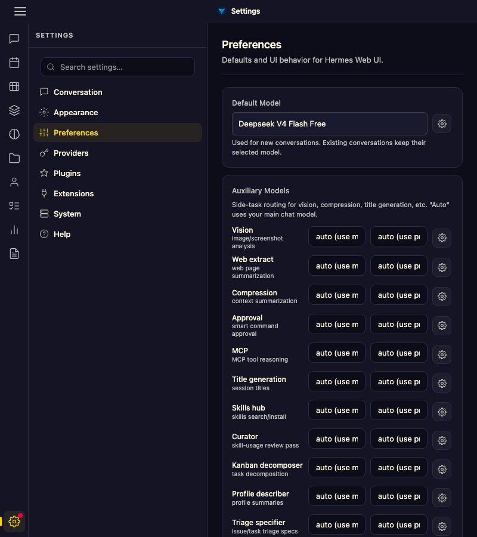
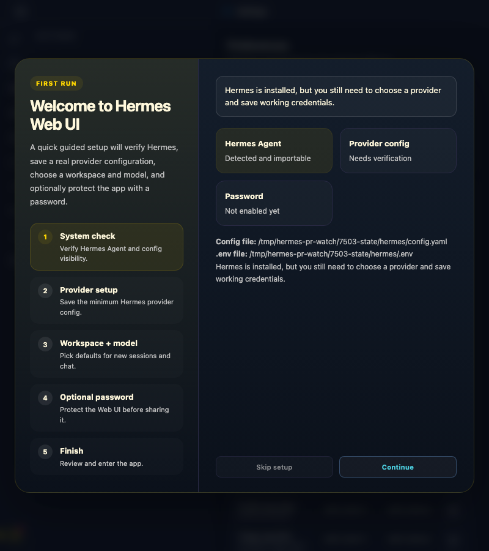
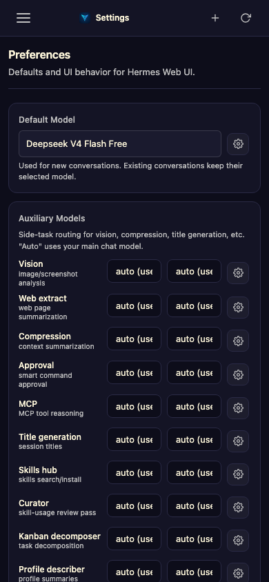
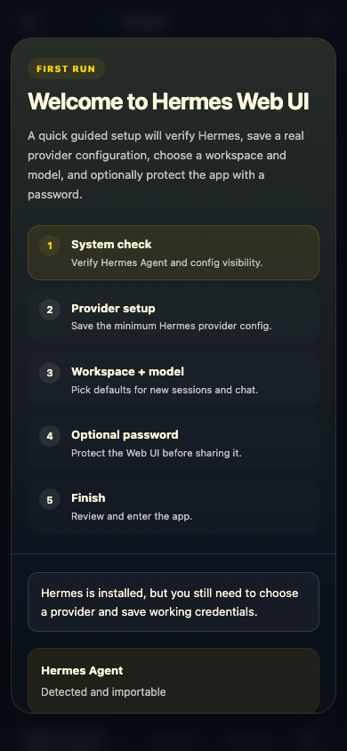

# PR 7503 responsive Settings evidence

Captured from the merge base (`94fd2da8`) and PR head at the same viewport sizes after opening **Settings → Preferences** and scrolling the Auxiliary Models area into view.

| Viewport | Before | After |
| --- | --- | --- |
| Desktop (1440×1000) |  |  |
| Narrow (800×900) |  |  |
| Mobile (390×844) |  |  |

Automated browser checks at all three widths confirmed the new checkbox is visible and within the viewport, and both the Preferences pane and Settings content have equal `scrollWidth` and `clientWidth` (no local horizontal overflow).
