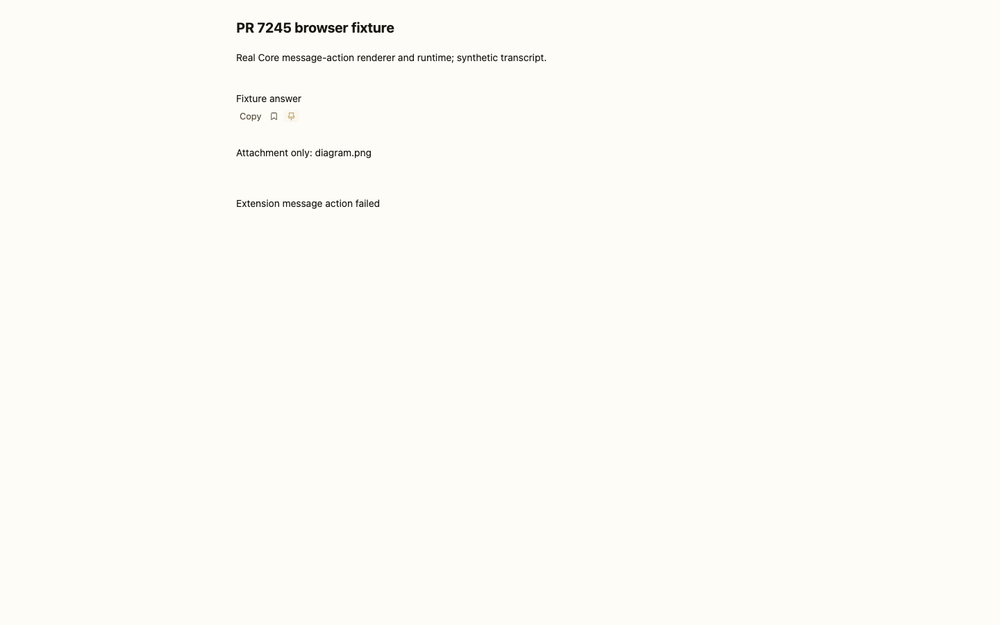
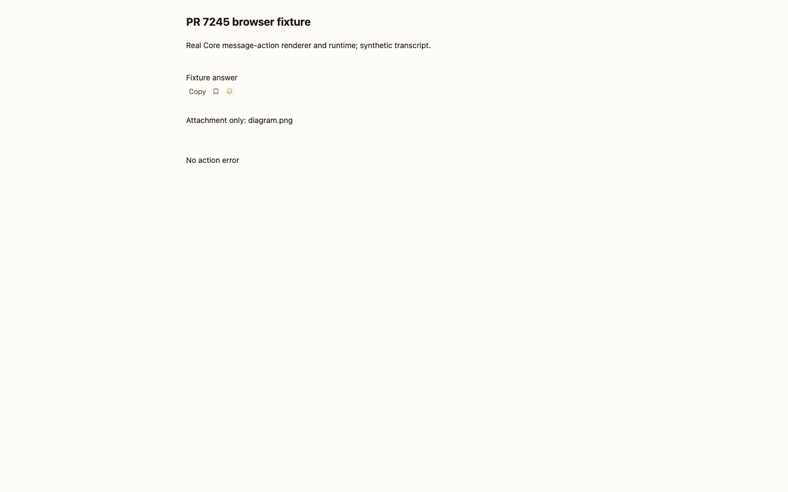
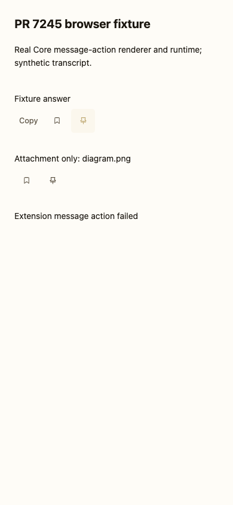
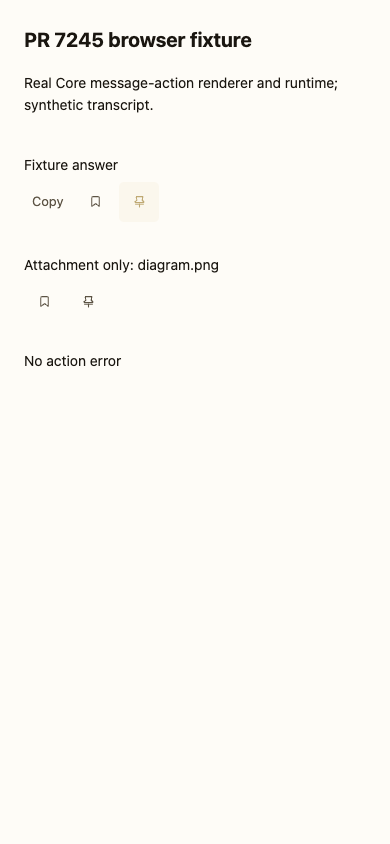

# PR #7245 — retired message-action failure proof

Captured on 2026-09-20 in Chrome 153.0.8010.52 with fresh, disposable browser
contexts, at 1440 × 900 and 390 × 844. No real sessions, model calls, credentials,
production state, or existing browser profile were used.

## What the images prove

These are explicitly **synthetic transcript fixtures**, not screenshots of a live
user conversation. They compose the current production message-action rendering
helpers from `static/ui.js`, the actual icons/styles, and the complete extension
runtime. The fixture's status line displays the message passed to Core's error
callback; it is not a screenshot of the full application's toast styling.

The before/after variable is the runtime: before uses published PR head
`b3c2e39f219b9778200fdeebd1a777764c112726`; after uses the repaired runtime on the
integration containing upstream `10003f46d48415a7f5691b2018ad76bfe5486863`.

The test clicks an action, unregisters it, registers and starts a replacement
with the same ID/target, then rejects the original native Promise. Before,
the old invocation reports one error even while the replacement is correctly
pending. After, it reports none; the replacement remains pending until its own
completion. Neither case produces an uncaught browser exception.

| Viewport | Before | After |
|---|---|---|
| 1440 × 900 |  |  |
| 390 × 844 |  |  |

The same browser fixture also exercised pressed-state invalidation, duplicate
click suppression, concurrent targets, attachment-only empty text, frozen click
context, connected-opener focus, HTML-cache reconstruction, hidden-row exclusion,
stale-index rejection, and uninstall cleanup. Narrow action targets measured
40 × 40 px. This does not prove every full-app virtualization or network-recovery
schedule; those retain the separate repository tests and hosted lifecycle gates.

## Reproducible regression tests

```sh
./scripts/test.sh tests/test_extension_message_actions.py -k retired_message_action -q
```

All four variants failed at the observable error callback before the product fix
and passed afterward: unregister, same-ID replacement, uninstall, and a thenable
that reports failure after already reporting success. Existing tests continue to
verify that errors from a current invocation are surfaced.

A separate agent-free smoke check booted the real `server.py` with isolated HOME,
state and workspace on loopback, then loaded `/`, `/#settings`, and `/#sessions`
at both viewports: zero console errors and zero uncaught exceptions. The fixture
images above are not presented as evidence of that separate full-app check.
