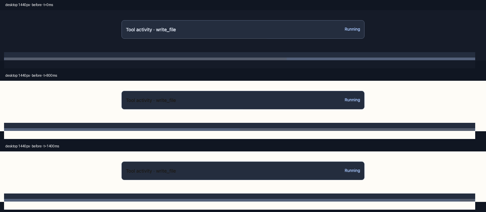
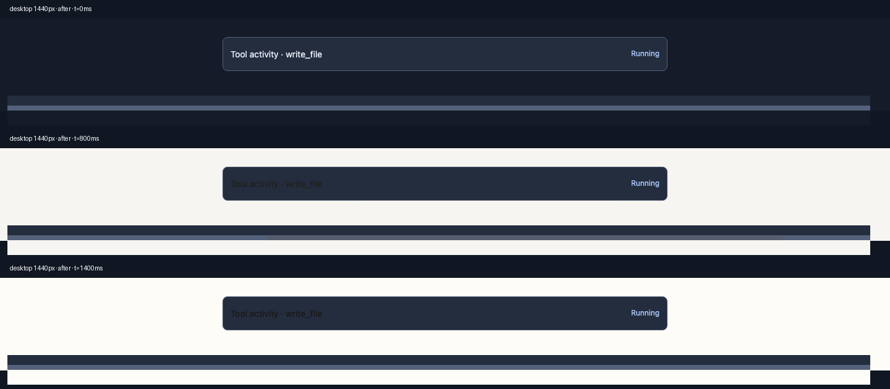
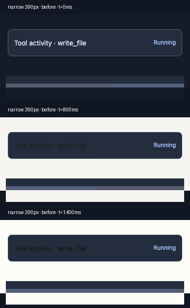
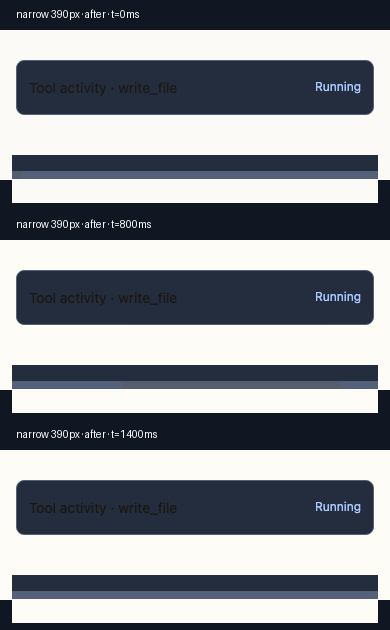

# Running-progress visual comparison (#7495)

Chromium screenshots of an isolated tool-activity fixture using the **real complete `static/style.css`** from upstream `origin/master` (before) and this PR (after). No live WebUI, credentials, or user session. Frames are paused at 0, 800, and 1400 ms of the same 1.6-second animation. The lower strip in each frame magnifies the actual one-pixel progress track for inspection; the upper part is at normal scale. These still frames show the path, not the perceived smoothness or iPad battery usage.

| Viewport | Before | After |
| --- | --- | --- |
| Desktop 1440 px |  |  |
| Narrow 390 px |  |  |

The original segment starts at the track's left edge and uses animated `left`/`right` offsets. The replacement starts clipped outside the left edge, crosses the track, then leaves past the right edge using a transform; this visual trajectory change is intentional for an indeterminate running indicator. Both use a 60%-track segment. [Measured frame geometry and keyframes](metrics.json) were read from the rendered pseudo-element at both widths. The separate browser performance test covers compositor/layout behavior and reduced motion.
