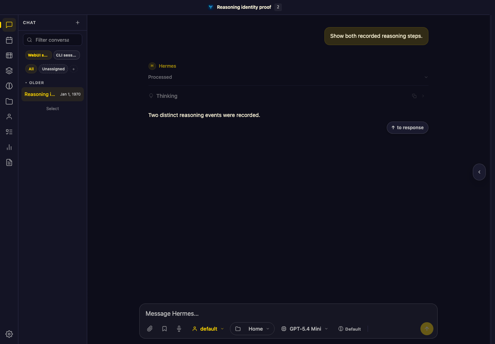
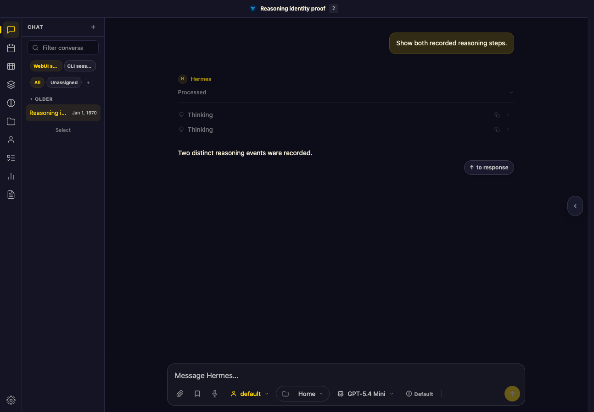
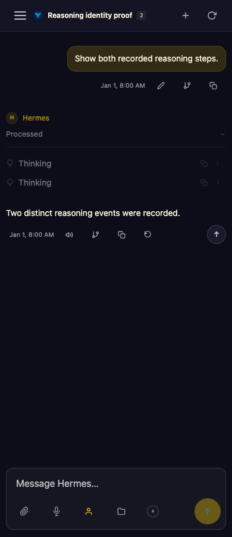

# Stored reasoning identity: browser evidence

These are synthetic persisted-session fixtures, not user conversations. They run
through `Session.save()`, the real WebUI HTTP session loader and the unmodified
browser renderer. No Agent/provider invocation is made. Public static assets load
as in the existing browser gates; this is not a network sandbox certification.

Frozen baseline: `ff26335b87610f70d74ff008608a321fb1281bd1`.
The fixture contains two same-text events with IDs A/B and one exact redelivery
of A. Before the API fix, both initial load and hard reload show only A. After the
fix they show A/B exactly once. Tests assert the DOM row identities, not merely
that two labels are visible. The Thinking cards are collapsed in these captures;
the machine-readable snapshots also check their identical retained text.

| State | Desktop (1280px) | Narrow (390px) |
| --- | --- | --- |
| Before |  |  |
| After |  |  |

Reproduce from the candidate checkout:

```sh
.venv/bin/python tests/browser_reasoning_identity_hydration.py --artifact-dir /tmp/reasoning-proof
```

The same driver on the baseline fails all four load/reload × desktop/narrow
identity assertions. It uses disposable Hermes/state/workspace directories and
stops its own server/browser; it does not modify production sessions. Test setup
initially lacked the seed directory and a trial's blanket external-resource block
caused console failures. Neither was counted as product RED evidence. The final
baseline/candidate comparison uses the same corrected driver.
