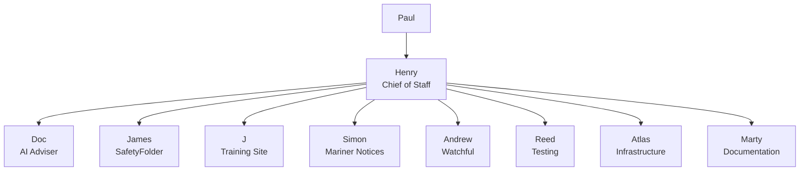

# SafetyFolder AI Team for Hermes WebUI

Status: Proposed implementation specification  
Owner: Paul Greenwood  
Target: Paulwatchful/hermes-webui  
Primary workspace: SafetyFolder2

## 1. Purpose

Extend Hermes WebUI with a clear, friendly AI team interface for managing work across the SafetyFolder product family.

This feature must preserve the existing benefits of Hermes:

- persistent memory;
- skills and project instructions;
- model and provider selection;
- session history;
- workspace access;
- scheduled tasks;
- messaging integrations;
- tool use;
- sub-agent delegation;
- approvals and security controls.

The AI team is an orchestration and presentation layer over Hermes. It must not replace or duplicate the Hermes agent runtime.

SafetyFolder is the main product and source of truth. Changes to connected products must follow the rules, skills, architecture, coding standards and documentation in the active SafetyFolder repository.

## 2. Product areas

The team supports four connected product areas:

1. **SafetyFolder** — the main web platform and primary development project.
2. **SafetyFolder Training Site** — a safe training and demonstration environment that should reflect relevant SafetyFolder workflows.
3. **Mariner Notices** — outward-facing notices to mariners, project information, maps, vessels and published project information.
4. **Watchful** — the vessel application connecting guard boats and offshore users to SafetyFolder.

A change in one area may create work in other areas. Henry and Doc must identify these dependencies rather than treating every request as isolated.

## 3. Team structure



### Henry — Chief of Staff and orchestrator

Henry is the default entry point for new work.

Responsibilities:

- receive and understand every request;
- identify the affected products and repositories;
- ask for missing information when it materially affects the result;
- split larger requests into clear tasks;
- select the correct specialist or specialists;
- delegate work through Hermes' existing sub-agent facilities;
- coordinate cross-product work and dependencies;
- request testing and documentation when appropriate;
- review returned evidence before reporting completion;
- provide Paul with one clear consolidated response.

Henry normally coordinates rather than performs specialist development. He must never claim that delegated work is complete until the responsible specialist has returned evidence and the relevant verification has passed.

Henry may answer simple routing, status and team questions directly.

### Doc — AI guru and technical adviser

Doc is an advisory role inspired by the inventive, energetic character in *Back to the Future*. The interface and text may convey enthusiasm, but must not imitate an actor's appearance or voice.

Responsibilities:

- maintain an understandable record of important technical decisions;
- track meaningful architectural and workflow changes;
- identify work that affects multiple products;
- recommend current engineering and AI best practices;
- identify security, maintainability, privacy and reliability risks;
- highlight technical debt and outdated approaches;
- advise on model, tool and skill selection;
- recommend improvements to the AI team itself;
- review significant plans without taking control away from Paul.

Doc does not automatically block work. Advice should be classified as:

- **Information**
- **Recommendation**
- **Risk**
- **Decision required**

### James — Main SafetyFolder development

Responsibilities:

- implement and maintain the main SafetyFolder web platform;
- follow all repository-local instructions and skills;
- preserve SafetyFolder as the source of truth;
- identify API, schema and UI changes that affect connected products;
- provide Reed with testable acceptance criteria;
- notify Marty when documentation is affected.

### J — SafetyFolder Training Site

Responsibilities:

- inspect and maintain the training site;
- keep relevant training workflows aligned with SafetyFolder;
- use safe sample data and remain isolated from live data;
- identify differences between the training and main platforms;
- test training workflows after updates;
- notify Henry when changes also affect Mariner Notices or Watchful.

J must not invent different business behaviour unless Paul approves it.

### Simon — Mariner Notices

Responsibilities:

- maintain notices to mariners and outward-facing project information;
- maintain map, feature, vessel and project-information workflows;
- verify that published information is understandable and appropriate;
- coordinate shared SafetyFolder data and authentication changes with James;
- provide acceptance criteria for Reed and documentation needs for Marty.

### Andrew — Watchful

Responsibilities:

- maintain the Watchful vessel application;
- manage its API and data relationship with SafetyFolder;
- consider intermittent connectivity and offshore operational use;
- identify mobile, Windows and deployment impacts;
- coordinate contract or schema changes with James;
- provide test requirements covering connected and offline behaviour.

### Reed — Testing and quality assurance

Responsibilities:

- turn requirements into acceptance criteria and test cases;
- run or coordinate relevant automated and manual tests;
- perform regression checks across affected products;
- confirm evidence rather than relying on implementation claims;
- report failures with reproducible steps;
- provide a clear pass, conditional pass or fail result.

Reed should remain independent of the implementing persona.

### Atlas — Infrastructure and deployment

Responsibilities:

- local development services;
- servers, containers, reverse proxies and networking;
- CI/CD and deployment;
- secrets and environment configuration;
- backups, monitoring, health checks and rollback plans;
- release readiness and post-deployment verification.

Atlas must treat production changes as controlled operations requiring explicit authority.

### Marty — Documentation

Responsibilities:

- developer and architecture documentation;
- user guidance and training instructions;
- release notes and change summaries;
- operational runbooks;
- keeping documentation aligned with verified behaviour.

Marty documents what has been implemented and verified, not merely what was planned.

## 4. Operating model

Use one main SafetyFolder Hermes profile with shared project context. Do not create a completely isolated Hermes profile for every persona by default.

Each persona should be represented by:

- a role definition;
- routing keywords and product ownership;
- a specialist system prompt or skill;
- relevant workspace and repository context;
- allowed tools and safety constraints;
- a standard handoff/result format.

This approach retains shared Hermes memory while giving each specialist a clear responsibility.

A future version may allow different models per specialist, but model selection must remain compatible with Hermes' existing provider and fallback system.

## 5. Request lifecycle

1. Paul submits a request to Henry.
2. Henry classifies the affected product areas and risk.
3. Henry asks a concise clarification only when necessary.
4. Henry creates one or more assignments.
5. Specialists complete investigation or implementation using existing Hermes tools.
6. Reed verifies changes when behaviour or code changed.
7. Marty updates documentation when required.
8. Doc reviews significant architectural, security or cross-product implications.
9. Henry consolidates the evidence, risks and next actions.
10. Paul receives a single understandable result.

Suggested assignment states:

- Proposed
- Awaiting clarification
- Ready
- In progress
- Awaiting review
- Testing
- Blocked
- Completed
- Cancelled

## 6. Required handoff format

Every specialist should return:

- **Summary** — what was done or discovered;
- **Affected areas** — products, repositories and files;
- **Evidence** — tests, commands, screenshots, diffs or links;
- **Risks** — known limitations or concerns;
- **Follow-up** — additional work and the recommended owner;
- **Status** — completed, blocked or needs review.

Henry should use these fields to build the final response and Team screen status.

## 7. Team screen

Add a **Team** navigation item to the existing Hermes WebUI sidebar. It should open a dedicated panel without disrupting chat, sessions or the workspace browser.

### Version 1

The first version should provide:

- a clear team structure;
- a card for every persona;
- role descriptions and product ownership;
- routing examples;
- an **Ask Henry** action;
- an action on each specialist card that starts a correctly contextualised request;
- responsive behaviour consistent with the existing desktop and mobile UI;
- existing theme, localisation and accessibility conventions.

Version 1 may use a checked-in configuration file and does not require a new database.

### Later versions

Future iterations may add:

- current and recent assignments;
- status, blockers and handoffs;
- links to relevant Hermes sessions;
- Doc's recommendations and decision register;
- items awaiting Reed's verification;
- outstanding Marty documentation;
- filters by product, persona and status;
- optional notifications for completed or blocked assignments.

## 8. Proposed configuration

Prefer data-driven persona definitions rather than hard-coding each card throughout the frontend.

A possible configuration shape is:

```json
{
  "team": {
    "name": "SafetyFolder AI Team",
    "default_router": "henry",
    "members": [
      {
        "id": "henry",
        "name": "Henry",
        "role": "Chief of Staff",
        "type": "orchestrator",
        "owns": ["routing", "coordination"]
      },
      {
        "id": "doc",
        "name": "Doc",
        "role": "AI Guru",
        "type": "adviser",
        "owns": ["decisions", "best-practice", "change-awareness"]
      }
    ]
  }
}
```

The implementation may use JSON, YAML or existing WebUI settings storage after reviewing current conventions. Do not create an incompatible configuration system solely for this feature.

## 9. UX principles

- Keep the normal chat experience available.
- Make Henry the simplest starting point without forcing all users through a wizard.
- Use names and plain-English roles rather than technical agent terminology.
- Show who owns a task and why it was routed there.
- Distinguish planned, in-progress and verified work.
- Do not imply that personas are humans.
- Make cross-product impact visible.
- Keep important approvals with Paul.
- Use existing design tokens, themes, icons and responsive patterns.
- Avoid a busy dashboard; show details progressively.

## 10. Safety and governance

- Read repository-local instructions before acting in a project.
- Do not expose secrets in prompts, logs, memory or the Team screen.
- Preserve existing user work and unrelated changes.
- Production deployment, destructive operations and external communications require the appropriate authority.
- Use branches and reviewable changes for development where practical.
- Record who performed implementation and who verified it.
- Never fabricate tests, tool results, commits or deployments.
- Keep training data isolated from production information.
- Require explicit confirmation for meaningful cross-system or production changes.

## 11. Implementation phases

### Phase 1 — Documentation and persona definitions

- agree the roles and ownership;
- add persona prompt/skill definitions;
- define Henry's routing rules;
- define the specialist handoff schema;
- define Doc's decision and recommendation format.

### Phase 2 — Static Team screen

- add the sidebar Team item;
- add the Team panel and responsive cards;
- load team members from one configuration source;
- add Ask Henry and specialist request actions;
- add UI and navigation tests.

### Phase 3 — Hermes routing integration

- pass the selected persona and product context into a new or existing session;
- use Hermes' existing sub-agent delegation rather than a second agent runtime;
- surface delegation activity using existing sub-agent cards;
- retain profile, model, tool, memory and approval behaviour.

### Phase 4 — Assignment tracking

- introduce persistent assignments and handoffs;
- associate assignments with Hermes sessions;
- show owner, state, blockers and verification status;
- add Doc's decision register.

### Phase 5 — Automation and change awareness

- detect relevant repository changes;
- suggest connected-product reviews;
- identify missing tests or documentation;
- optionally schedule summaries and maintenance checks.

## 12. Version 1 acceptance criteria

Version 1 is complete when:

1. A Team item is visible in supported sidebar and mobile navigation.
2. Opening Team does not lose or corrupt the active chat session.
3. All nine personas display with the correct names and responsibilities.
4. Ask Henry starts or focuses a session with Henry's routing context.
5. A specialist action includes that persona's role and the active workspace context.
6. Existing profiles, models, tools, memory, sessions and workspace features continue to work.
7. The screen works with existing light/dark themes and supported skins.
8. Keyboard navigation and accessible labels are present.
9. Relevant existing tests continue to pass.
10. New navigation and persona-configuration behaviour has test coverage.
11. No production SafetyFolder access is required to display the Team screen.

## 13. Non-goals for the first version

- replacing the Hermes agent runtime;
- implementing a separate model gateway;
- creating nine isolated memory systems;
- autonomous production deployment;
- allowing specialists to bypass Hermes approvals;
- building a complex project-management product;
- automatically editing SafetyFolder repositories merely by opening the Team page.

## 14. Implementation instruction for Hermes

When asked to implement this proposal:

1. Read this document completely.
2. Read the repository's current architecture, UI/UX and testing guidance.
3. Inspect the latest sidebar, mobile navigation, panel and profile implementations.
4. Produce a file-level plan before editing.
5. Reuse existing components and conventions.
6. Implement only the agreed phase.
7. Run the relevant tests and runtime checks.
8. Return changed files, evidence, risks and follow-up work.
9. Do not begin a later phase without Paul's approval.

## 15. Key decision

The personas are a coordinated view over Hermes, not separate replacement agents.

Hermes remains responsible for memory, skills, models, tools, sessions, approvals and delegation. The SafetyFolder AI Team provides understandable ownership, routing and visibility for Paul.
