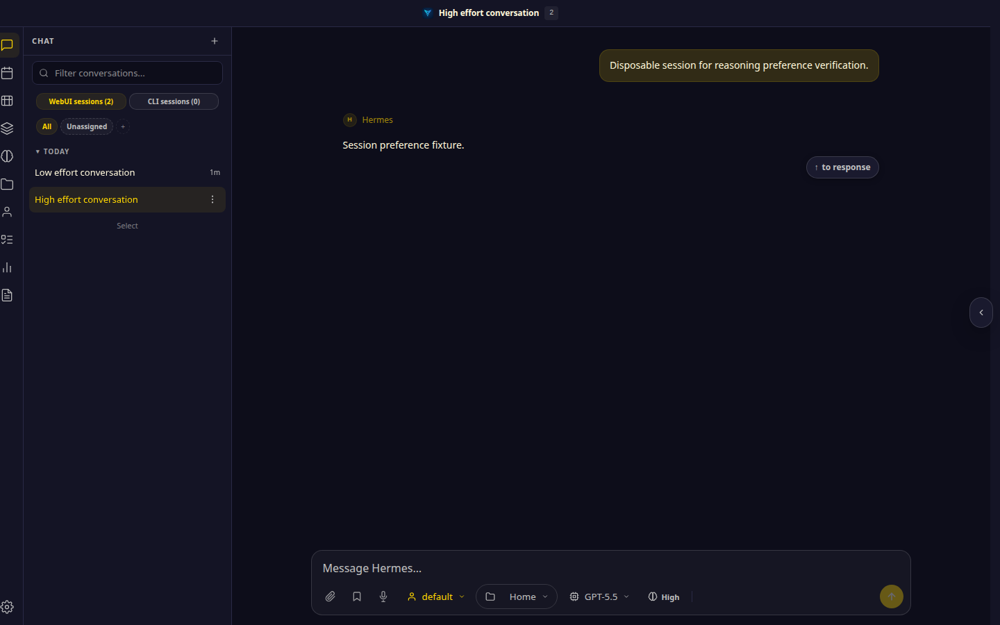
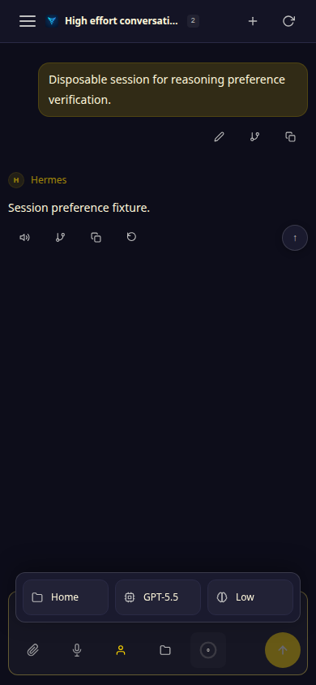
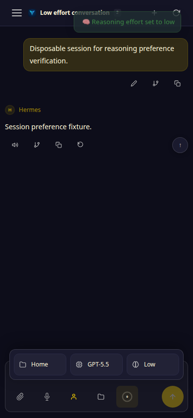
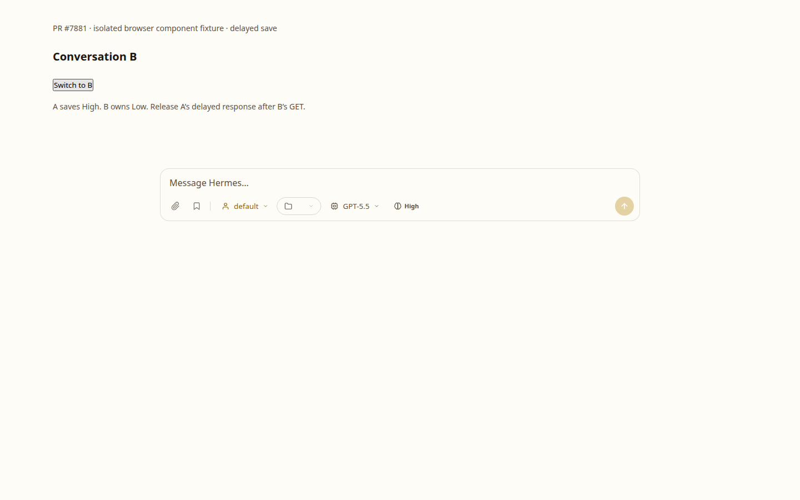
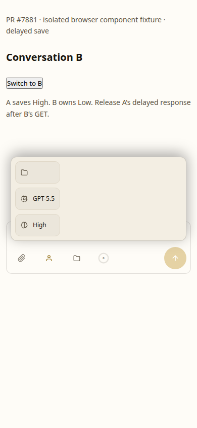
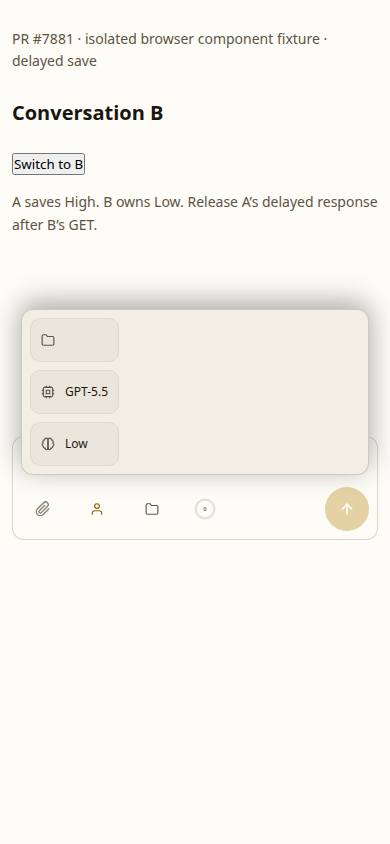

# Per-session reasoning effort: PR #7881

Actual app screenshots from the revision before the PR (`c296673e`) and the
review-fix revision (`57c1fef3`). The two disposable conversations use GPT-5.5
with different effort selections. No provider request was made; these captures
verify browser controls and session state, not external model behavior.

Sequence: select High in conversation A, select Low in conversation B, then
switch back to A through the sidebar.

## Desktop: 1440 × 900

Before the PR, A displays Low after returning from B:

After the PR, A restores High:

B displays its selected Low effort:

## Mobile: 390 × 844

The hamburger sidebar and mobile configuration action are used for the same
A High → B Low → A sequence. The configuration panel is open so both model and
effort are visible.

Before the PR, A displays Low:

After the PR, A restores High:

B displays Low:

## Observed assertions

- Before: returning to A displays Low at both widths; the reasoning POST has no
  session identity.
- After: returning to A restores High, revisiting B restores Low, and reloading
  A restores High at both widths. The reasoning POST includes the active
  session identity.
- Screenshots are direct browser captures from disposable fixture sessions.
  No DOM labels were rewritten and no live provider calls were made.
- The same-model fixture demonstrates independent efforts. Different-model
  combinations are described in the PR use case but were not exercised by
  this capture.

## Delayed effort save follow-up

The latest review's delayed-POST race is reproduced in an isolated Chromium
component fixture using the actual composer markup, stylesheet, reasoning section
of `static/ui.js`, and `cmdReasoning()` from `static/commands.js`. Before is PR
head `7e38ea41`; after is the context-guard follow-up. The fixture supplies delayed
API promises and a session-switch button; it does not run the full application,
contact a provider, or prove server persistence. No chip labels are rewritten.

Sequence: A requests High; switch to B; B's GET resolves Low; A's delayed POST
resolves High; run a routine chip sync. Both the dropdown and `/reasoning high`
were exercised at 1440 × 900 and 390 × 844, including the mobile configuration
button and effort action. Before, B incorrectly ends at High. After, B remains
Low. All eight browser scenarios passed without page errors. Images show the
dropdown sequence and were visually inspected.

| Viewport | Before: B incorrectly shows High | After: B keeps Low |
| --- | --- | --- |
| Desktop |  |  |
| Mobile |  |  |

`tests/test_reasoning_effort_save_race.py` drives the real callbacks and rendered
desktop/mobile labels. Eight context-change cases failed on the unchanged PR
head (both entry points × session/model/provider/profile); unchanged-context
saves passed. With the fix, all twelve cases pass, also covering an older GET
resolving after a successful save and refetching the saved value when returning
to A. The server remains the durable owner; the UI retains its existing single
visible-context cache rather than introducing a second per-session store.
