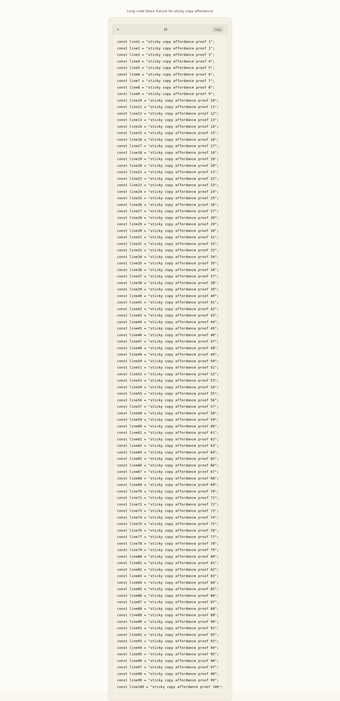
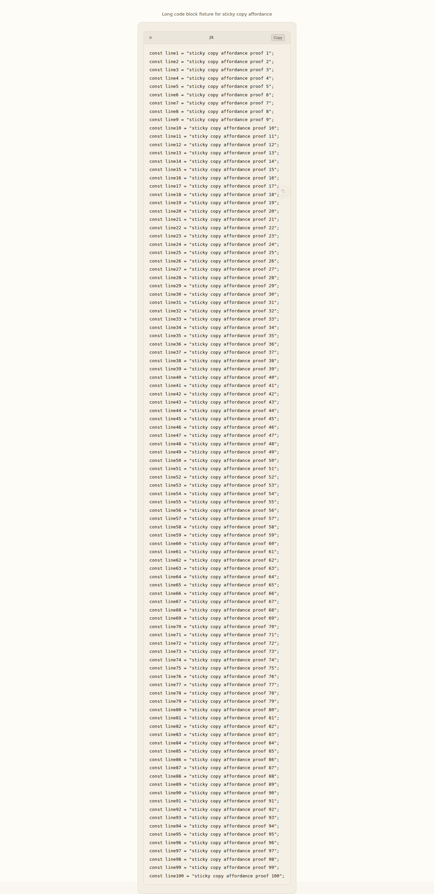

# Sticky code-block copy affordance

Status: implemented

## Problem

Hermes WebUI already renders a copy button for code blocks:

- language fences get a `pre-header` row with a `Copy` button;
- unlabeled fences get an absolutely positioned `Copy` button inside the `pre`.

That works well for short snippets. It is weaker for long code blocks because the
copy control scrolls away with the top of the block. Users reading or selecting
content near the middle or bottom must scroll back to the top before copying the
whole snippet.

The goal is to improve long-code-block ergonomics without making transcript
chrome louder than the conversation.

## Chosen approach

Keep the existing copy button and add a second, icon-only sticky affordance inside
a non-overflowing wrapper around each code block.

The implemented DOM shape is:

```html
<div class="code-block-wrap">
  <div class="pre-header">js <button class="code-copy-btn">Copy</button></div>
  <div class="code-copy-sticky-actions">
    <button class="code-copy-sticky-btn" aria-label="Copy code">...</button>
  </div>
  <pre><code>...</code></pre>
</div>
```

Unlabeled fences omit the header but keep the wrapper and sticky action row.
JSON/YAML tree-view blocks keep their existing `.code-tree-wrap`; the code adds
`.code-block-wrap` to that same wrapper instead of nesting another card around it.

Both copy controls use the same source of truth:

```js
_copyText(codeEl.textContent)
```

That keeps copy behavior independent from syntax highlighting, diff spans, and
JSON/YAML tree rendering.

## Options considered

| Option | Outcome | Why |
| --- | --- | --- |
| Keep only the existing top/header copy button | Rejected | Familiar, but it does not help once the top of a long block scrolls away. |
| Move the existing copy button to a sticky position | Rejected | Removes a familiar control location and risks changing behavior for short snippets. Keeping it avoids a visual/interaction regression. |
| Add a JavaScript scroll listener that moves a floating button | Rejected | More moving parts, more layout reads/writes, and more risk in long transcripts. It also creates another runtime path to maintain during streaming/re-rendering. |
| Put `position: sticky` directly inside `<pre>` | Rejected | Code blocks use horizontal overflow. Sticky positioning inside an overflow container can stick relative to the wrong ancestor or fail in browser-specific ways. |
| Wrap the header and `pre`, then use native CSS sticky for a second icon-only button | Chosen | Minimal JavaScript, bounded naturally by the block/card, preserves existing controls, works with horizontal code scrolling, and fits the calm-console design language. |

## Implementation constraints

- No new dependencies, framework, build step, or scroll watcher.
- Preserve the existing `.code-copy-btn` in the header or `pre`.
- Keep wrapper/action insertion idempotent because `postProcessRenderedMessages()`
  can run repeatedly after render, streaming updates, cache replay, and final
  post-processing.
- Keep sticky outside the horizontally scrollable `pre`.
- Preserve the connected `.pre-header + pre` visual shape when the sticky row is
  inserted between them.
- Preserve special code-block renderers:
  - `diff`/`patch` spans inside `<pre>`;
  - JSON/YAML `.code-tree-wrap` and tree/raw toggles;
  - unlabeled fences with their existing top-right copy button.

## Visual behavior

The sticky icon is intentionally quiet:

- low opacity by default;
- stronger on hover/focus/copy feedback;
- compact enough not to cover much code;
- `pointer-events: none` on the sticky action row and `pointer-events: auto` only
  on the button, so text selection and scrolling remain natural.

On narrow/touch screens the button is slightly larger and more visible, but still
scoped to the code block.

### Visual evidence

Before: while reading a long code block, the only copy control is the original
top/header button, so the affordance can scroll away.



After: the original header button remains, and a small sticky icon stays bounded
inside the code block while the user scrolls.



## Verification checklist

Automated/source-level checks should cover:

- `addCopyButtons()` still copies with `_copyText(codeEl.textContent)`;
- existing header copy duplicate guard remains;
- wrapper insertion is idempotent and does not double-wrap;
- sticky action insertion is idempotent and does not duplicate buttons;
- sticky behavior is CSS-based and does not introduce scroll listeners;
- JSON/YAML tree wrappers are preserved.

Manual/browser checks should cover:

- long language-fenced block on desktop;
- long unlabeled block on desktop;
- narrow/mobile width;
- horizontal scrolling or wrapped code on narrow screens;
- copy feedback for both the existing and sticky buttons.
